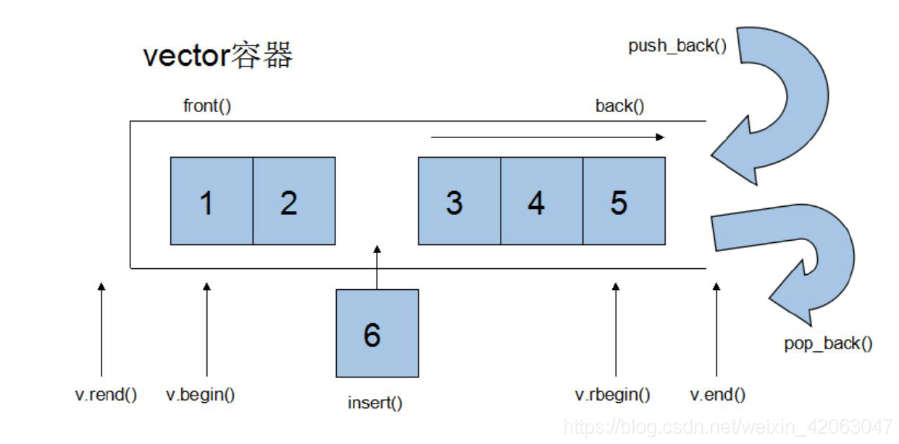
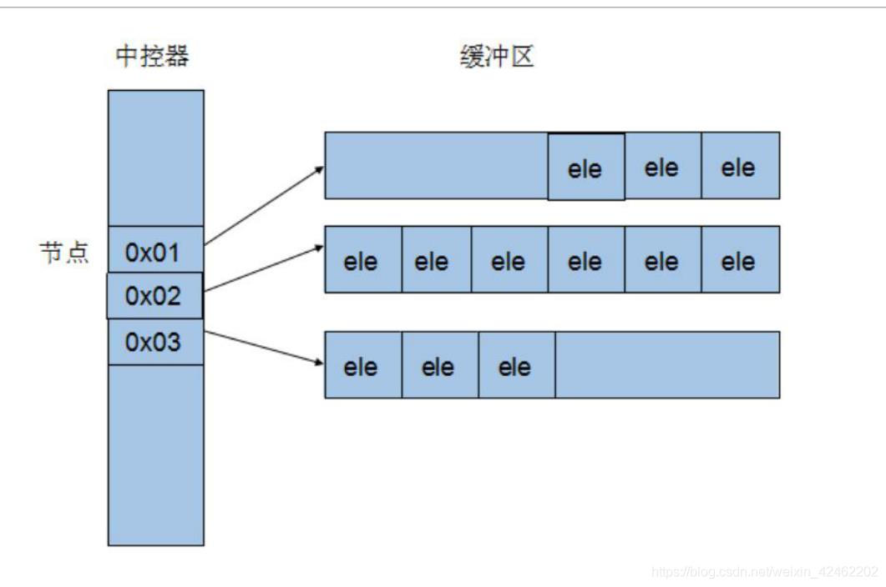
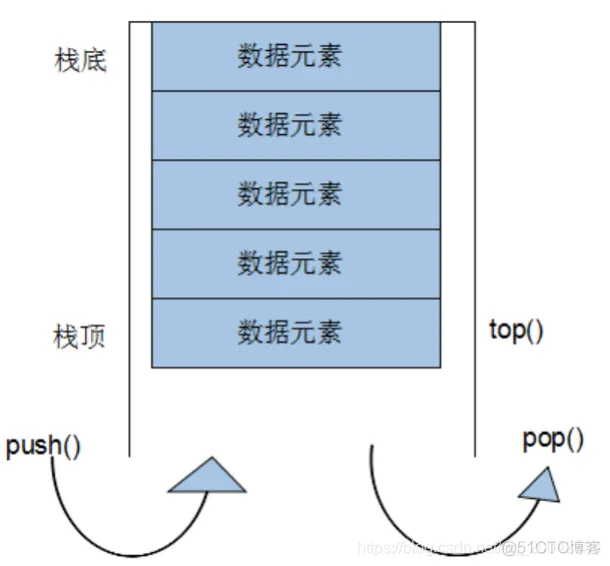
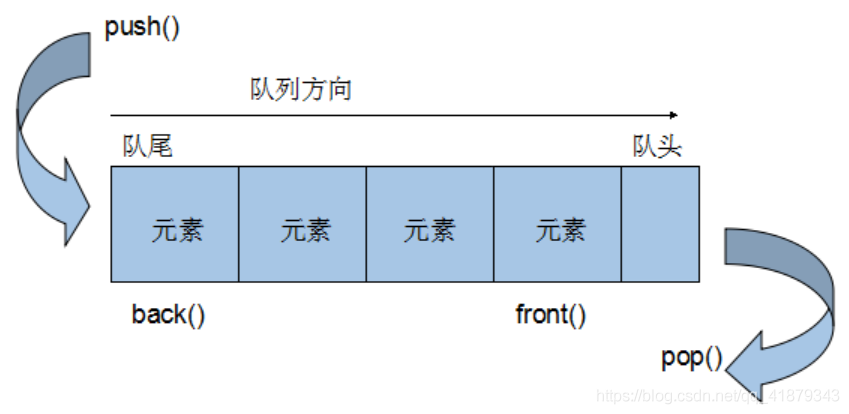
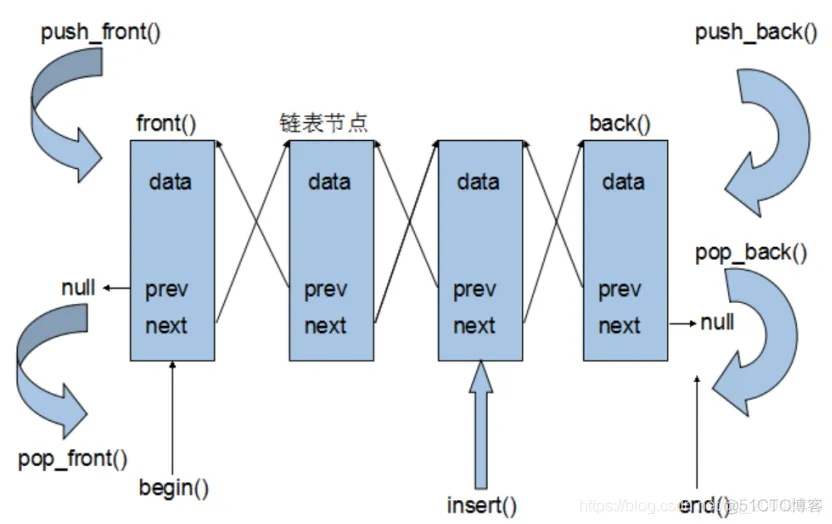

> 这是一份C++笔记，重点介绍面向对象、泛型编程的语法和细节，介绍一些常见库的用法。
> 
> 参考：
> 
> * [黑马程序员C++教程](https://www.bilibili.com/video/BV1et411b73Z/?p=1)
> 
> * C++ Primer E4
> 
> * [C语言中文网](http://c.biancheng.net/)
> 
> Dknt
> 
> 2023.1

# C++基础编程

这一部分介绍C++的基础语法，他们与C语言语法大体上是相同的。

## 1 基础部分

### 1.1 注释

两种注释方式：单行注释、多行注释

```cpp
// 单行注释

/**
 * 多行注释 
*/
```

### 1.2 变量

左值：可以位于等号左边。常量不是左值。

右值：只能位于等号右边。

全局变量：定义于函数体外的变量，在整个工程文件内都有效。

局部变量：定义于函数体内的变量。

静态全局变量：`static`关键字修饰的，定义于函数体外的变量，只在定义它的文件内有效。

静态局部变量：`static`关键字修饰的，定义于函数体内的变量，只在定义它的函数内有效。只分配一次内存，函数返回后，该变量不会消失。

### 1.3 常量

常量可以通过两种方式实现：宏定义、const修饰符。

```cpp
// 宏定义
#define PI 3.1415926

// const修饰符
const double pi = 3.14;
```

这两种方式**不等价**。#define宏定义是预编译指令，在编译过程中替换关键字；而const用于修饰变量，被修饰变量在程序运行时真实存在于内存中，权限为只读。

全局常量：`const`关键字修饰的，定义于函数体外的常量，位于全局区。

局部常量：`const`关键字修饰的，定义于函数体外的常量，位于栈区。

除此之外，程序中的字符串为字符串常量，存放于全局区中。

```cpp
// "Hello World!"为字符串常量
cout << "Hello World!" << endl;
// 可以输出字符串常量的地址
cout << (int)&"Hello World!" << endl;
```

### 1.4  关键字

C++关键字如下

| —          | —            | —                | —           | —          |
|:----------:|:------------:|:----------------:|:-----------:|:----------:|
| asm        | *do*         | *if*             | *return*    | *typedef*  |
| *auto*     | *double*     | *inline*         | *short*     | typeid     |
| *bool*     | dynamic_cast | *int*            | *signed*    | typename   |
| *break*    | *else*       | *long*           | *sizeof*    | *union*    |
| *case*     | *enum*       | mutable          | *static*    | *unsigned* |
| *catch*    | explicit     | *namespace*      | static_cast | *using*    |
| *char*     | *export*     | new              | *struct*    | *virtual*  |
| *class*    | *extern*     | *operator*       | *switch*    | *void*     |
| *const*    | *false*      | *private*        | *template*  | *volatile* |
| const_cast | *float*      | *protected*      | *this*      | wchar_t    |
| *continue* | *for*        | *public*         | *throw*     | *while*    |
| *default*  | *friend*     | register         | *true*      |            |
| delete     | *goto*       | reinterpret_cast | try         |            |

auto - 自动类型

throw&catch - 异常检测

volatile - 不优化变量，常用于寄存器编程

### 1.6 标识符命名规则

1. 标识符不能是关键字

2. 标识符只能由字母、数字、下划线组成

3. 第一个字符必须是字母或下划线

4. 区分大小写

C++命名习惯：

* 不要乱起名！

* 函数：imageProcess（驼峰命名法）

* 类、结构、枚举：ClassType

## 2 数据类型

给变量分配合适的内存空间。

可以通过sizeof关键字来查看数据类型占用的空间

```cpp
sizeof(int);
```

### 2.1 整型

| 数据类型      | 名称   | 占用空间                         | 取值范围                              |
| --------- | ---- |:---------------------------- | --------------------------------- |
| short     | 短整形  | 2B                           | -2^15 ~ 2^15-1                    |
| int       | 整型   | 4B                           | -2^31 ~ 2^31-1                    |
| long      | 长整型  | 4B(Win Linux32), 8B(Linux64) | -2^31 ~ 2^31-1<br/>-2^64 ~ 2^64-1 |
| long long | 长长整型 | 8B                           | -2^64 ~ 2^64-1                    |

### 2.2 实型

| 数据类型   | 名称     | 占用空间 | 取值范围       |
| ------ | ------ |:---- | ---------- |
| float  | 单精度浮点数 | 4B   | 7位有效数字     |
| double | 双精度浮点数 | 8B   | 15~16位有效数字 |

字面值3.14为double型，而3.14f为float型。

默认情况，输出小数显示6位有效数字。

科学计数法：3e2

### 2.3 字符型

| 数据类型 | 名称  | 占用空间 | 取值范围         |
| ---- | --- |:---- | ------------ |
| char | 字符型 | 1B   | -2^7 ~ 2^7-1 |

ASCII表


### 2.4 转义字符

| 转义字符 | 意义                   | ASCII码值（十进制） |
| ---- | -------------------- | ------------ |
| \a   | 响铃(BEL)              | 007          |
| \b   | 退格(BS) ，将当前位置移到前一列   | 008          |
| \f   | 换页(FF)，将当前位置移到下页开头   | 012          |
| \n   | 换行(LF) ，将当前位置移到下一行开头 | 010          |
| \r   | 回车(CR) ，将当前位置移到本行开头  | 013          |
| \t   | 水平制表(HT)             | 009          |
| \v   | 垂直制表(VT)             | 011          |
| \'   | 单引号                  | 039          |
| \"   | 双引号                  | 034          |
| \\\  | 反斜杠                  | 092          |

### 2.5 字符串

C风格字符串

```cpp
char str1[] = "this is a C type string";
```

长度固定，最后一个字符为'\0'。

C++ String库

```cpp
std::string str2 = "this is an object of class string";
```

长度可调整，提供一系列方法。

### 2.6 布尔类型

bool只有两种取值：true(~0), false(0)

占用1B

### 2.7 数据输入

iostrean库提供标准输入输出流

```cpp
#include <iostream>

int main(){
    int a;
    std::cin >> a;
    std::cout << "a = " << a << std::endl;
    return 0;
}
```

## 3 运算符

运算符用于执行代码的运算，主要有以下几类：

| 运算符类型 | 作用                  |
| ----- | ------------------- |
| 算术运算符 | 用于处理四则运算            |
| 赋值运算符 | 用于将表达式的值赋给变量        |
| 比较运算符 | 用于表达式的比较，并返回一个bool值 |
| 逻辑运算符 | 根据表达式的逻辑返回bool值     |

### 3.1 算术运算符

| 运算符 | 术语   | 示例              | 结果           |
|:---:|:----:|:---------------:|:------------:|
| +   | 正号   | +3              | 3            |
| -   | 负号   | -3              | -3           |
| +   | 加    | 10 + 5          | 15           |
| -   | 减    | 10 - 5          | 5            |
| *   | 乘    | 10 * 5          | 50           |
| /   | 除    | 10 / 5          | 2            |
| %   | 取余   | 10 % 3          | 1            |
| ++  | 前置递增 | a = 2; b = ++a; | a = 3, b = 3 |
| ++  | 后置递增 | a = 2; b = a++; | a = 3, b = 2 |
| --  | 前置递减 | a = 2; b = --a; | a = 1, b = 1 |
| --  | 后置递减 | a = 2; b = a--; | a = 1, b = 2 |

小数不能做取模运算

### 3.2 赋值运算符

| 运算符 | 术语  | 示例              | 结果    |
|:---:|:---:|:---------------:|:-----:|
| =   | 赋值  | a = 3;          | a = 3 |
| +=  | 加等于 | a = 4; a += 2;  | a = 6 |
| -=  | 减等于 | a = 4; a -= 2;  | a = 2 |
| \*= | 乘等于 | a = 4; a \*= 2; | a = 8 |
| /=  | 除等于 | a = 4; a /= 2;  | a = 2 |
| %=  | 模等于 | a = 4; a %= 3;  | a = 1 |

### 3.3 比较运算符

| 运算符 | 术语   | 示例     | 结果    |
|:---:|:----:|:------:|:-----:|
| ==  | 相等于  | 4 == 3 | false |
| !=  | 不等于  | 4 != 3 | true  |
| <   | 小于   | 4 < 3  | false |
| >   | 大于   | 4 > 3  | true  |
| <=  | 小于等于 | 4 <= 3 | false |
| >=  | 大于等于 | 4 >= 3 | true  |

### 3.4 逻辑运算符

| 运算符 | 术语  |
|:---:|:---:|
| !   | 非   |
| &&  | 与   |
|     | \|  |

## 4 程序流程结构

C++支持三种最基本的程序流程结构：

* 顺序结构

* 选择结构

* 循环结构

### 4.1 选择结构

#### 4.1.1 if语句

* 单行if语句

```cpp
if(condition){
    statement;
}
```

* 多行if语句

```cpp
if(condition){
    statement1;
}
else{
    statement2;
}
```

* 多条件if语句

```cpp
if(condition1){
    statement1;
}
else if(condition2){
    statement2;
}
...
else{
    statement;
}
```

if语句可以嵌套

#### 4.1.2 三目运算符

```cpp
condition ? expression1 : expression2;
```

如果条件满足，返回sentence1，不满足则返回sentence2。

三目运算符可以返回**左值**。

#### 4.1.3 switch语句

```cpp
switch(condition){
    case expression1:
        statement1;
        break;
    case expression2:
        statement2;
        break;
    ...
    default:
        statement;
        break;
}
```

switch的条件只能是字符或整型。

switch执行效率比多条件if高。

### 4.2 循环结构

使用**break**退出当前循环。

使用**continue**跳转到下一次循环。

循环可以嵌套。

#### 4.2.1 while循环

```cpp
while(condition){
    statement;
}
```

满足条件进入循环。

#### 4.2.2 do...while循环

```cpp
do{
    statement;
}while (condition);
```

先进行一次循环，再判断。

#### 4.2.3 for循环

for相比前两种循环结构清晰。这几种循环运行效率没有太大区别。

```cpp
for(declaration-or-expression; condition; expression){
    statement;
}
```

for语句中的三个表达式都可以缺省。

#### 4.2.4 区域for循环

C++11后。遍历序列中所有元素。

```cpp
for(range-declaration: range-expression){
    statement;
}
```

range-declaration定义变量，类型与序列中的元素相同。可以使用auto自动确定变量类型。

### 4.3 跳转语句

#### 4.3.1 break语句

用于跳出选择结构或循环结构。

break的使用：

1. 出现在switch语句中，终止case并跳出switch。

2. 出现在循环语句中，跳出当前循环语句。

3. 出现在循环嵌套中，跳出最近的内层循环语句。

#### 4.3.2 continue语句

跳过本次循环中未执行的语句，进行下一次循环。

#### 4.3.3 goto语句

无条件跳转。**不建议使用**。很像汇编语言中的跳转。

```cpp
goto FLAG;
FLAG:
```

## 5 数组

数组中每个元素都是**相同数据类型**，在内存中**连续**存放。

### 5.1 一维数组

定义方式：

1. `datatype name[length]; // 声明`

2. `datatype name[length] = {data1, data2, ...}; // 列表初始化`

3. `datatype name[] = {data1, data2, ...}; // 列表初始化`

可以通过下标访问数组中的元素，数组索引从0开始。

一维数组的数组名可用于统计整个数组在内存中的长度。

```cpp
int arr[5];
// sizeof中写入数组时，返回数组在内存中的长度，单位为字节。
std::cout << sizeof(arr) << std::endl;
```

一维数组的数组名代表数组在内存中的首地址。

数组名是常量，不能作为左值。 

### 5.2 二维数组

定义方式：

1. `datatype name[row][col];`

2. `datatype name[row][col] = {{data1, data2},  {data3, data4}};`

3. `datatype name[row][col] = {data1, data2, data3, data4};`

4. `datatype name[][col] = {data1, data2, data3, data4};`

和一维数组类似，二维数组也可以查看数组占用的内存空间大小，以及查看数组的首地址。

## 6 函数

函数将一段经常使用的代码**封装**起来，减少代码重复量。

一个较大的程序，一般分为若干个程序块，每个模块实现特定的功能。

### 6.1 函数的定义

函数定义的五个要素

1. 返回值类型

2. 函数名

3. 参数列表

4. 函数体

5. return表达式（函数体中）

语法：

```cpp
returnType functionName(param1, ...){
    ...
    return  returnValue;
}
```

### 6.2 函数的调用

使用`函数名(参数)`的方式调用函数。调用函数时，实参的值会传递给形参。可能存在类型提升。

注意命名空间的对应。

### 6.3 值传递

调用函数时会发生值传递，将实参的值会传递给形参。之后，在子函数中改变形参时，实参不受影响（引用类型形参除外），他们在内存中的位置是不同的。

### 6.4 函数的常见样式

1. 有参有返

```cpp
int fun1(int a){
    return b;
}
```

2. 有参无返

> `return`可以省略。

```cpp
void fun1(int a){
    return;
}
```

3. 无参有返

```cpp
int fun1(){
    return b;
}
```

4. 无参无返

```cpp
void fun1(){
    return;
}
```

### 6.5 函数的声明

作用：告诉编译器函数的名称及参数、返回值类型。

C++中的函数在调用前必须被声明（函数被定义的同时也会被声明）。

函数的声明可以有多次，函数的定义只能有一次。

<mark>可以在一个函数的内部写另一个函数的声明。</mark>

### 6.7 函数分文件编写

函数分文件编写可以实现模块化，让代码结构更清晰。

步骤：

1. 创建头文件`*.h`

2. 创建源文件`*.cpp`

3. 在头文件中写函数申明

4. 在源文件中写函数定义

头文件：

```cpp
// fun1.h
#ifndef FUNC1_H
#define FUNC1_H
int func1(int);
#endif
```

源文件：

```cpp
// func1.cpp
#include "func1.h"
int func1(int a){
    return a * 2;
}
```

## 7 指针

可以通过指针简介访问内存。

内存编号是从0开始记录的，一般用十六进制数字表示。

可以利用指针变量保存地址。

### 7.1 指针变量的定义和使用

定义语法。

```cpp
dataType *pointerName;
```

指向变量，用变量地址给指针赋值。

```cpp
pointerName = &data1;
```

使用变量，用解引用方式获取、改变变量值。

```cpp
data2 = *pointerName;
*pointerName = data3;
```

### 7.2 指针所占用的内存空间

32位操作系统占4个字节，64位操作系统占8个字节。与指针类型无关。

x86是32位的，x64是64位的。

### 7.3 空指针和野指针

**空指针**指向内存中编号为0的空间，用于初始化指针变量。空指针指向的内存是不可访问的（0-255之间的内存被系统占用，访问会出错）。

```cpp
int *p = NULL;
int *p = nullptr;
```

**野指针**为指向非法内存空间的指针。指向进程所占用合理内存空间之外的指针。

### 7.4 const修饰指针

const修饰指针有三种情况：

1. 常量指针。底层const，指向常量的指针，指针本身是变量。

2. 指针常量。顶层const，指针指向固定对象，可以通过指针读写这个对象。

3. 指向常量的指针常量。顶层、底层const，指针指向固定对象，不能通过指针写这个对象。

```cpp
const int *p1; // 常量指针
int * const p2 = &data1; // 指针常量
const int * const p3 = &data1; // 指向常量的指针常量
```

指针常量和指向常量的指针常量在定义时必须初始化。

常量指针可以指向一个变量，但不能通过这个指针改变变量的值。可以用读写权限来理解，常量指针是不具备写权限的。

### 7.5 指针和数组

可以利用指针访问数组中的元素，实现类似迭代器的效果。

通过指针加减整数、自加、自减来实现指针的移动。

```cpp
int arr[10] = {1, 2, ...};
int *p = arr;
std::cout << *++p << std::endl; // 输出数组中第二个元素
```

### 7.6 指针与函数——地址传递

函数形参中可以有指针，在调用函数时需要将实参取地址。通过这种方式可以在子函数中改变实参内容。

若形参为常量指针，则不可以通过该形参改变实参内容。

用指针或引用传递参数的好处在于，不需要进行大量数据的拷贝，节省时间与内存空间。

## 8 结构体

结构体属于用户自定义的数据类型，允许用户存储不同的数据类型。

### 8.1 结构体的定义和使用

语法示例：

```cpp
struct structType{
    dataType1 member1;
    dataType2 member2;
};
```

创建结构体变量：

* `struct structType dataName;`

* `struct structType dataName = {data1, data2};`

* 定义结构体同时创建结构体变量。

在高版本C++中可以不加`struct`关键字，直接使用结构类型名称定义结构体变量。在C语言中，通常使用`typedef`重命名。

```cpp
typedef struct structType{
    dataType1 member1;
    dataType2 member2;
}structName;
```

通过`.`运算符加成员名称的方式访问结构体成员。

```cpp
dataName.member1
```

### 8.3 结构体数组

语法：

```cpp
struct structType arrName[number] = {{}, {}, ...}
```

### 8.4 结构体指针

结构体指针通过`->`运算符加成员名称访问结构体成员。

```cpp
struct structType *ptr = &dataName;
std::cout << ptr->member1;
```

### 8.5 结构体嵌套

结构体成员可以是另一个已经被定义的结构体。

### 8.6 结构体做函数参数

可以使用值传递、地址传递、引用传递将结构体作为子函数的参数。

使用地址传递、引用传递可以节省时间和内存空间。

### 8.7 结构体中的const

函数形参为结构指针或引用时，可以加关键字const，进行写保护。

### 8.8 内存对齐

有效对其值：是给定值#pragma pack(n)和结构体中最长数据类型长度中较小的那个。有效对齐值也叫**对齐单位**。

对齐规则：

1. 结构体第一个成员的**偏移量（offset）**为0，以后每个成员相对于结构体首地址的 offset 都是**该成员大小与有效对齐值中较小那个**的整数倍，如有需要编译器会在成员之间加上填充字节。

2. **结构体的总大小**为 有效对齐值 的**整数倍**，如有需要编译器会在最末一个成员之后加上填充字节。

```cpp
#include<stdio.h>
struct
{
    int i;    
    char c1;  
    char c2;  
}x1; // x1占用内存为8B

struct{
    char c1;  
    int i;    
    char c2;  
}x2; // x2占用内存为12B

struct{
    char c1;  
    char c2; 
    int i;    
}x3; // x3占用内存为8B
```

# C++面向对象

这一部分介绍C++面向对象编程，是C++的核心部分。

## 1 内存分区模型

C++程序在执行时，将内存大方向分为4个区域：

代码区：存放函数的二进制代码，由操作系统进行管理。

全局区：存放全局变量、静态变量、常量。

栈区：由编译器自动分配释放，存放函数的参数值，局部变量等。

堆区：由程序员分配和释放，若程序员不释放，程序结束时由操作系统回收。

> 内存五区就是将全局区再分为全局\静态区和常量区。

不同区域存放的数据有不同的生命周期，提升了编程灵活性。

### 1.1 程序运行前

程序编译后生成可执行文件，未执行该程序时分为两个区域：代码区和全局区。

**代码区**

* 存放CPU执行的机器指令。

* 代码区是共享的，对于频繁被执行的程序，只需要在内存中保留一份。

* 代码区是只读的，防止被意外修改指令。

**全局区**

* 存放全局变量和静态变量。

* 全局区包含常量区，字符串常量和全局常量也存放在此。

* 该区域的数据在程序结束后由操作系统释放。

### 1.2 程序运行时

**栈区**

* 由编译器自动分配释放，存放函数的型参、局部变量等。

* 栈区的数据由编译器自动释放（保留一段时间后释放），因此不要将局部变量地址作为返回值。

**堆区**

* 由程序员分配和释放，若程序员不释放，程序结束时由操作系统回收。

* 在C++中使用`new`在堆区开辟内存。

### 1.3 new运算符

在堆区申请内存使用关键字`new`。内存申请返回该数据对应类型的指针。语法如下：

```cpp
new dataType;
/* Example */
int *p = new int(10); // 在堆区创建整数
int *arr = new int[10]; // 在堆区创建整形数组
```

堆区的内存需要由程序员手动释放。内存释放使用关键字`delet`。语法如下：

```cpp
delete data;
```

## 2 引用

引用即别名。语法如下：

```cpp
dataType &newName = dataName;
```

特点：

* 引用必须被初始化。

* 初始化后，不可以再指向其他变量。引用一定是顶层const。

### 2.1 引用做函数参数——引用传递

引用做函数时，可以利用引用让形参指向实参。这种方式相比指针传递更为方便，因为指针对变量的访问还需要取内容。

### 2.2 引用做函数返回值

函数的返回值可以是引用。

注意：

* 不要返回局部变量的引用。可以返回静态变量，全局变量，或调用位置处代码块内变量的引用。

* 当函数返回引用时，函数的调用可以作为左值。

### 2.3 引用的本质

引用的本质在C++内部实现是一个**指针常量**，顶层const。

编译器在编译过程中会在引用定义位置创建一个指针常量，并在使用引用的地方将引用替换为指针常量取内容。

### 2.4 常量引用

常量引用通常用来修饰形参，防止误操作。顶层const+底层const。

```cpp
const int &ref = data;
```

### 2.5 右值引用

右值引用`&&`。

## 3 函数高级

### 3.1 函数的默认参数

在C++中，函数形参列表中的形参是可以有默认值的。调用函数时，可以不给出a的值。

语法如下：

```cpp
// 参数b的默认值为10
void funcName(int a, int b = 10){
    ...
}
```

注意：

* 如果某个位置的参数有默认值，那么从这个位置往后的参数也必须有默认值。

* 如果某函数声明中有默认值，那么这个函数的实现中不能有默认参数（否则产生二义性）。例如：

```cpp
int func(int a = 10, int b = 20);
int func(int a, int b){
    ...
}
```

### 3.2 函数的占位参数

C++函数的参数列表中可以有占位参数，用于占位，调用函数时必须填补该位置。

占位参数可以有默认参数，这种情况下，调用函数时可以不传参。

示例如下：

```cpp
// 如下函数中，第二个参数为占位参数，第三个参数为带默认参数的占位参数
void func(int a, int, int = 10){
    ...
}
int main(){
    func(2, 5);
    return 0;
}
```

### 3.3 函数重载

重载可以使带不同类型参数的函数使用同一个函数名，这样可以提高代码复用性。

函数重载的条件：

* 函数位于同一作用域下

* 函数名称相同

* 函数参数需要满足如下条件之一：**类型不同**、**个数不同**或**顺序不同**。

函数返回值不同不能作为函数重载的条件。

重载函数的返回值类型可以不同。

```cpp
void func(int a){
    cout << "func(int a)" << endl;
}

/* 个数不同 */
void func(int a, int b){
    cout << "func(int a, int b)" << endl;
}

/* 类型不同 */
void func(int a, double a){
    cout << "int a, double a" << endl;
}

/* 顺序不同 */
void func(double a, int a){
    cout << "double a, int a" << endl;
}
```

函数重载的注意事项：

* 引用作为重载条件。引用可以作为函数的重载条件，但需要注意一些规则，如下所示。

```cpp
// 向这个函数传参不能传入常量区的数据，即调用时不能直接写常数。
void func(int &a){
    cout << "func(int a)" << endl;
}

// 向这个参数传入常量时，会创建临时量
void func(const int &a){
    cout << "func(const int a)" << endl;
}
```

* 函数重载中的默认参数。默认参数可能引起二义性，当函数调用存在二义性时，编译报错。

```cpp
void func(){}

void func(int a = 10){}

int main(){
    // 编译产生错误，因为存在二义性。
    func();
}
```

## 4 类和对象

> 这是C++最重要的部分。

C++面向对象的三大特性：**封装**、**继承**、**多态**。

C++认为**一切皆对象**，对象上有其属性和行为。

具有相同性质（属性和行为）的对象，可以抽象为类。

### 4.1 封装

#### 4.1.1 封装的意义

封装是C++面向对象三大特性之一。

封装的意义：

* 将属性和行为看作一个整体

* 将属性和行为的权限加以控制

访问权限共有以下三种：

* 公共权限`public`。任意位置、任意对象都可以访问。

* 保护权限`protected`。类内的成员可以访问，类外的成员不可以访问，子类可以访问。

* 私有权限`private`。类内成员可以访问，类外的成员不可以访问，子类不可以访问。

#### 4.1.2 struct和class的区别

C++中`struct`和`class`的唯一区别在于默认权限。

* `struct`的默认权限为`public`。

* `class`的默认权限为`private`。

#### 4.1.3 成员属性私有化

成员属性私有化的优点：

* 控制读写权限。

* 编写公共的成员函数，作为接口用于属性的读写。在成员函数中可以检测输入数据的有效性。

### 4.2 对象初始化和清理

C++中的每个对象都会有初始设置以及对象销毁前的数据清除设置。

#### 4.2.1 构造函数和析构函数

对象的**初始化**和**清除**是两个非常重要的安全问题。

* 使用一个未经初始化的变量，其结果是未知的。

* 使用完的变量，如果没有及时清理，其结果也是未知的。

C++使用**构造函数**和**析构函数**解决上述两个问题，当对象被创建或销毁时，编译器会自动调用这两个函数。如果我们没有编写构造函数和析构函数，编译器会自动帮我们编写空的构造函数和析构函数。

* 构造函数用于创建对象时为对象的成员属性赋值。

* 析构函数用于进行销毁对象时的清理工作。

构造函数和析构函数写在`public`下。

**构造函数**语法：

```cpp
class Hello{
public:
    Hello(); // 构造函数
    ~Hello(); // 析构函数
    Hello(int a); // 构造函数重构
    Hello(const Hello& h); // 拷贝构造函数
};
```

1. 构造函数没有返回值，不写void。

2. 构造函数名称**与类名相同**。

3. 构造函数可以有若干参数，因此**可以发生重载**。

4. 创建对象时会自动调用构造函数且只会调用一次，无需手动调用。

**析构函数**语法：

1. 析构函数没有返回值，不写void。

2. 析构函数名称为**类名前加~**。

3. 析构函数不可以有参数，因此**不可以重载**。

4. 在销毁对象前会自动调用析构函数且只会调用一次，无需手动调用。

也可以在类内声明成员属性时给出默认初始化值！

```cpp
class Person{
    int age = 10; // age的默认初始化值为10
};
```

#### 4.2.2 构造函数的分类及调用

两种分类方式：

* 按参数分类：无参构造（默认构造函数）、有参构造。

* 按类型分类：普通构造、拷贝构造。

```cpp
class Hello{
public:
    Hello(); // 默认构造函数
    Hello(int); // 有参构造函数
    Hello(const Hello&); // 拷贝构造函数
};
```

三种调用方式：

* 括号法。

* 显式法。创建匿名对象，并用它来赋值，不常用。

* 隐式转换法。

如下所示：

```cpp
int main(){
    /* 括号法 */
    Hello h1; // 默认构造函数
    Hello h2(10); // 有参构造函数
    Hello h3(h1); // 拷贝构造函数
    Hello h4(); // 歧义！这是函数h4的声明！！！

    /* 显式法 */
    Hello e1 = Hello();; // 默认构造函数
    Hello e2 = Hello(10); // 有参构造函数
    Hello e3 = Hello(e1); // 错误！被视为重定义！！！

    /* 隐式转换法 */
    Hello l1 = 10; // 有参构造函数
    Hello l2 = l1; // 拷贝构造函数
}
```

> `Hello(10);`创建了<mark>匿名对象</mark>，当前行执行结束时，系统会立即回收匿名对象。

注意：

* 调用默认构造函数时，不要加括号，<mark>编译器会将这种写法看作是函数的声明</mark>。

* 不要用拷贝构造函数初始化匿名对象。编译器会认为`Hello(e1);`等价于`Hello e1;`，相当于对`e1`进行重定义。

#### 4.2.3 拷贝构造函数调用的时机

C++中拷贝构造函数的调用通常有三种情况：

* 使用一个已经创建的对象初始化另一个对象。

* 以值传递的方式给另一个函数传参。（栈区创建临时变量）

* 以值的方式返回局部对象。（栈区临时创建）

```cpp
Hello func(){
    Hello h1;
    return h1;
}

int main(){
    Hello h2 = func();
    return 0;
}
```

视频中，通过这种方式给h2赋值是拷贝赋值，程序执行过程中创建两个Hello对象。但实际在Linux下g++编译后的结果中，h2的初始化方式与h1相同，是默认初始化。如果打印出二者的地址，会发现他们的地址也是相同的。猜测是因为编译器对代码做了优化，直接使用默认初始化。

#### 4.2.4 构造函数的调用规则

默认情况下，C++编译器至少给一个类添加3个成员函数（还有一个赋值运算符）：

1. 默认构造函数（无参数，空函数体）

2. 默认析构函数（无参数，空函数体）

3. 默认拷贝函数（参数为类的const引用，对每一个成员属性进行拷贝）

4. 默认列表初始化函数（参数为所有成员属性）

构造函数**调用规则**：

* 如果用户定义了有参构造函数，编译器不再提供默认无参构造，但会提供默认拷贝构造。

* 如果用户定义了拷贝构造函数，编译器不会再提供其他构造函数。

#### 4.2.5 深拷贝与浅拷贝

浅拷贝：简单的赋值拷贝操作。问题：<mark>堆区内存的重复释放</mark>。

深拷贝：在堆区重新申请空间进行拷贝操作。

有时类成员中有指针类型的成员属性，指向堆区中的变量。这样，在构造函数中需要在堆区中申请内存空间，在析构函数中也要做相应的释放内存操作。当这样的指针成员存在时，如果使用浅拷贝，指针会指向堆区中的同一个变量，其中一个变量的析构会导致变量内存的释放，导致堆区内存重复释放。

#### 4.2.6 初始化列表

C++提供初始化列表语法，用来初始化属性。

使用初始化列表时需要注意对应关系及顺序。

语法：`构造函数(): 属性1(值1), 属性2(值2)...{}`。

```cpp
class Person{
private:
    int m_a;
    int m_b;
public:
    Person(int a, int b): m_a(a), m_b(b); // 初始化列表
};


int main(){
    Person p(10, 20);
    return 0;
}
```

#### 4.2.7 类对象作为类成员

C++中类的成员可以是另一个类的对象，该成员称为对象成员。

例如：

```cpp
class A{};
class B{
    A a;
};
```

构造对象时，先构造对象成员，再构造本身。析构对象时，先析构本身，再析构对象成员。构造与析构顺序相反。

#### 4.2.8 静态成员

静态成员就是在成员变量或成员函数前加static。

因此，静态成员分为：

* 静态成员变量
  
  * 所有对象共享一份数据
  
  * 在编译阶段分配内存
  
  * **类内声明，类外初始化**

* 静态成员函数
  
  * 所有对象共享一个函数
  
  * 静态成员函数只能访问静态成员变量

```cpp
class Person{
public:
    static int counter; // 静态成员变量
    static void func(){ // 静态成员函数，类内声明
        cout << counter << endl;
    }
};

int Person::counter = 0; // 类静态成员变量初始化，类外初始化

int main(){
    Person p;
    p.func(); // 静态成员函数调用
    Person::func(); // 静态成员函数调用
}
```

静态成员变量和静态成员函数也都有访问权限的区别。

静态成员可以通过对象访问，也可以通过类名访问。

静态成员函数只能访问静态成员变量，因此不依赖于任何一个对象。它可以作为对象的方法调用，也可以作为类命名空间下的函数调用。

### 4.3 C++对象模型和this指针

#### 4.3.1 成员变量和成员函数分开存储

C++中类的成员变量和成员函数是分开存储的。成员函数存储于代码区。

只有非静态成员变量才属于类的对象。静态成员变量存储在全局区。

可以用`sizeof`输出对象占用的内存。**空类占用1个字节**，因为C++编译器会为每个空对象也分配一个字节空间，是为了区分空对象占内存的位置。每个空对象都有独一无二的内存地址。

#### 4.3.2 this指针

C++为成员函数提供特殊的对象指针——this指针。this指针指向被调用的成员函数所属的对象。

this指针不需要定义，直接使用即可。

this指针的本质是一个指针常量，顶层const。

用途：

* 当形参和成员变量同名时，可用this指针来区分

* 在类的非静态成员函数中返回对象本身，可使用`return *this;`

返回对象本身的引用可以实现链式编程：

```cpp
class Person{
private:
    int age = 0;
public:
    Person& addAge(int age){
        this->age += age;
        return *this;
    }
};

int main(){
    Person p;
    p.addAge(10).addAge(10);
    return 0;
}
```

#### 4.3.3 空指针访问成员函数

C++中类的空指针也可以调用成员函数，但需要注意有没有用到this指针。**在用到this的方法中需要加以判断**，以保证鲁棒性。示例如下：

```cpp
class Person{
public:
    int a;
    int getA(){
        if(this == nullptr){
            return -1;
        }
        return this->a;
    }
};
```

#### 4.3.4 const修饰成员函数

常函数：

* 成员函数后加`const`后变成常函数

* 常函数不可以修改成员属性

* 成员属性声明时加`mutable`关键字后，在常函数中仍然可以修改

常对象：

* 声明时加`const`的对象为常对象

* 常对象只能调用常函数

```cpp
class Person{
public:
    int age;
    mutable int height; // mutable成员属性
    void func() const{ // 常成员函数
        this->height++;
    }
};

int main(){
    const Person p; // 常对象
    p.func(); // 常对象只能调用常函数
}
```

常成员函数的this指针为常量指针常量，顶层const+底层const。

### 4.4 友元

友元的目的是让一个函数或类访问另一个类中的私有成员。关键字为`friend`。

友元的三种实现：

* 全局函数做友元（友元函数）

* 类做友元（友元类）

* 成员函数做友元

示例如下：

```cpp
class Person{
private:
    string name;
    friend void printName(Person &p); // 友元函数
    friend class Dog; // 友元类
    friend Cat::printMasterName(Person &p); // 成员函数做友元
};

class Dog{
public:
    void printMasterName(Person &p){
        cout << p.name << endl;
    }
};

class Cat{
public:
    void printMasterName(Person &p){
        cout << p.name << endl;
    }
};

void printName(Person &p){
    cout << p.name << endl;
}
```

### 4.5 运算符重载

对于内置数据类型，编译器按照默认的运算法则处理运算符。

运算符重载是对已有的运算符进行重新定义，赋予其另一种功能，以适应不同类型的数据类型。

运算符重载可以通过成员函数实现，也可以通过全局函数实现。

运算符重载可以实现函数重载，实现自定义数据类型与其他不同类型间的运算。

示例如下：

```cpp
class Person{
private:
    string name = "dknt";
    int age = 22;
public:
    Person operator+(const Person &p){ // 重载+，成员函数类内实现
        ...
    }
    Person operator-(const Person&); // 重载-，成员函数声明
};

// 运算符重载，类外实现  
Person Person::operator-(const Person &p){  
    ...
}

// 重载两个Person类之间的&，全局函数实现
Person operator&(const Person &p1, const Person &p2){
    ...
}
```

使用运算符重载时，会发生如下替换：

```cpp
Person p3 = p1 + p2;
Person p4 = p1 & p2;
// 替换为
Person p3 = p1.operator+(p2); // 成员函数本质调用
Person p4 = operator&(p1, p2); // 全局函数本质调用
```

可重载的运算符包括以下几种：

| 符号                | 名称        | 符号              | 名称      |
|:-----------------:|:---------:|:---------------:|:-------:|
| operator+         | 加         | operator-       | 减       |
| operator&         | 按位与       | operator\|      | 按位或     |
| operator~         | 按位取反      | operator^       | 按位异或    |
| operator>         | 大于        | operator<       | 小于      |
| operator==        | 等于        | operator\>=     | 大于等于    |
| operator<=        | 小于等于      | operator!=      | 不等于     |
| operator<<        | 左移        | operator>>      | 右移      |
| operator&=        | 与等于       | operator\|=     | 或等于     |
| operator^=        | 异或等于      | operator++      | 前置/后置递增 |
| operator--        | 前置/后置递减   | operator=       | 赋值运算符   |
| operator new      | 申请堆区内存    | operator delete | 销毁堆区内存  |
| operator delete[] | 以数组销毁堆区内存 |                 |         |

注意：

* 内置的数据类型表达是不能改变的

* 不要滥用运算符重载

#### 4.5.1 左移运算符重载

相比左移，`<<`运算符更常见地被用于输出。我们可以重载`std::cout`与类之间的`<<`运算符，按照我们想要的方式对类的成员属性做输出。

利用全局函数重载运算符。

`std::cout`类是`std::ostream`的子类，因此我们可以这样编写重载函数：

```cpp
class Person{
private:
    string name = "dknt";
public:
    friend std::ostream& operator<<(std::ostream& out, const Person &p);
}

std::ostream& operator<<(std::ostream& out, const Person &p){
    return out << p.name;
}

int main(){
    Person p;
    std::cout << p << std::endl;
    return 0;
}
```

注意：

* `std::cout`全局只能存在一个，因此传入必须写应用，返回也必须是引用。

#### 4.5.2 递增/递减运算符重载

递增运算符有前置与后置之别，可用通过是否包含`int`型参数来区分。

注意：**前置递增返回值，后值递增返回引用**。

```cpp
class Person{
public:
    int a;
    // 前置递增
    Person& operator++(){
        ...
    }
    // 后置递增，这里必须
    Person operator++(int){
        ...
    }
};
```

#### 4.5.3 赋值运算符重载

C++编译器会给一个类添加至少四个函数/运算符：

1. 默认构造函数

2. 默认拷贝构造函数

3. 默认析构函数

4. 默认列表初始化函数

5. 赋值运算符`operator=`

如果类中有属性指向堆区，那么赋值操作时也会出现深浅拷贝问题，需要自己重载赋值运算符来解决。

```cpp
class Person{
public:
    int *a;
    // 赋值
    Person& operator=(const Person &p){
        if(this->a != NULL){
            delete this->a;
            this->a = NULL;
        }
        this->a = new int(*p.a);
        return *this;
    }
};
```

#### 4.5.4 关系运算符重载

按照自己的方式比较两个对象，返回值类型位`bool`形。

#### 4.5.5 函数调用运算符重载

* 函数调用运算符`()`也可以重载。

* 由于重载后使用的方式非常像函数的调用，因此称为**仿函数**。

* 仿函数没有固定的写法，非常灵活。

在STL中应用很多。

```cpp
class MyPrinter{
public:
    void operator(string text){
        cout << text << endl;
    }
};

int main(){
    MyPrinter printer;
    printer("Hello world!"); // 通过对象调用仿函数
    MyPrinter()("Hello world again!"); // 通过匿名函数对象调用仿函数
    return 0;
}
```

### 4.6 继承

我们定义一系列类，他们当中一部分类的属性与方法是在另一部分类基础上进行了扩展，我们称他们之间存在继承关系。利用C++类继承的特性，使子类继承父类的属性与方法，可以减少重复代码。

继承的作用：减少重复代码。

#### 4.6.1 继承的基本用法

继承的基本语法为：`class 子类: 继承方式 父类`。

父类也称为**基类**，子类也称为**派生类**。

示例如下：

```cpp
class Person{
public:
    void sayHello(){
        cout << "Hello world!" << endl;
    }
    void sayGoodbye(){
        cout << "Goodbye world!" << endl;
    }
};

class Student: public Person{ // 公共继承
public:
    void goodGoodStudy(){
        cout << "I love study!" << endl;
    }
    void sayGoodbye(){ // 
        cout << "Goodbye school!" << endl;
    }
};
```

 子类中的成员包含两部分：从父类继承过来的成员（表现共性），自己增加的成员（表现个性）。

#### 4.6.2 继承方式

继承方式一共有三种：

* 公共继承`public`

* 保护继承`protected`

* 私有继承`private`

对于规则的解释：

* 父类中的`private`成员在任何继承方式下子类都不可访问，但创建子类对象时会为这些成员分配内存空间。

* 父类中`public`成员和`protected`成员可以被子类访问，他们的权限与继承方式有关。`public`继承下，子类中成员的权限与父类相同；`protected`继承下，子类将父类中的成员全部继承为`protected`；`private`继承下，子类将父类中的成员全部继承为`private`。


#### 4.6.3 继承中的对象模型

父类中所有**非静态成员属性**都会被子类继承下去。

父类中私有成员属性被编译器隐藏，因此子类访问不到，但确实是继承下去了。

使用如下命令查看类的内存布局：

```shell
$ g++ -fdump-lang-class main.cpp
```

#### 4.6.4 继承中的构造和析构顺序

子类继承父类后，当创建子类时，也会调用父类构造函数。

构建对象时，先调用父类构造函数，再调用子类构造函数。销毁对象时，先调用子类析构函数，再调用父类析构函数。（类似于之前类中包含成员类的情况）

#### 4.6.5 继承中同名成员处理方式

处理方式如下（包括成员属性与成员方法）：

* 访问子类同名成员：直接访问。

* 访问父类同名成员：需要加作用域。

如果子类中出现和父类同名的成员函数，子类的同名成员函数会**隐藏掉父类中所有同名函数，包括重载函数**。因此，需要调用父类同名成员函数时，一定要加父类作用域。

```cpp
class Base{
public:
    int a;
    Base(): a(10){}
    void func() {cout << "Base." << endl;}
};

class Son: public Base{
public:
    int a;
    Son(): a(20){}
    void func() {cout << "Son." << endl;}
};

int main(){
    Son s;
    cout << "Son's a: " << s.a << endl; // 访问子类同名成员
    cout << "Son's Base's a: " << s.Base::a << endl; // 访问父类同名成员
    s.func(); // 访问子类同名函数
    s.Base::func(); // 访问父类同名函数
    return 0;
}
```

#### 4.6.6 继承同名静态成员处理方式

静态成员和非静态成员出现同名的处理方式相同。

- 访问子类同名成员：直接访问。

- 访问父类同名成员：需要加作用域。

```cpp
class Base{
public:
    static int a;
};

class Son: public Base{
public:
    static int a;
};

int Base::a = 10;
int Son::a = 20;

int main(){
    Son s;
    cout << s.a << endl; // 访问子类静态变量
    cout << s.Base::a << endl; // 访问父类静态变量
    cout << Son::a << endl; // 通过类名访问子类静态变量
    cout << Son::Base::a << endl; // 通过类名访问父类静态变量
    cout << Base::a << endl; // 与上一行相同
    return 0;
}
```

#### 4.6.7 多继承

C++允许一个类继承多个父类。

语法：`class 子类: 继承方式 父类1, 继承方式 父类2, ...`。

多继承可能会引发父类中有同名成员出现，需要加作用域区分。

**C++实际开发中不建议使用多继承。**

#### 4.6.8 虚继承

用菱形继承问题引入虚继承。

菱形继承（钻石继承）概念：

* 两个派生类（B、C）继承同一个基类（A）

* 某个类（D）同时继承两个派生类

问题：D继承了B和C的数据，即继承了两份基类A的数据，导致资源浪费。

利用虚继承可以解决菱形继承问题。

<mark>虚继承</mark>：在继承时加关键字`virtual`的继承称为虚继承，被继承的类称为虚基类。

从B、C各自继承`vbptr`（虚基类指针），指向`vbtable`（虚基类表），这个表中的数据是唯一的。

例子如下：

```cpp
class Animal{
public:
    int a;
};

class Sheep: virtual public Animal{};
class Camel: virtual public Animal{};
class Alpaca: public Sheep, public Camel{};

int main(){
    cout << alp.a << endl; // 可以直接访问，不会引起歧义。
    return 0;
}
```

### 4.7 多态

#### 4.7.1 多态的基本概念

多态分为两类：

* 静态多态：函数重载和运算符重载属于静态多态，复用函数名。

* 动态多态：派生类和虚函数实现运行时多态。（多态通常指动态多态）

静态多态和动态多态的区别：

* 静态多态的函数地址早绑定——**编译阶段确定函数地址**。

* 动态多态的函数地址晚绑定——**运行阶段确定函数地址**。

C++允许子类向父类的类型转换，不需要强制类型转换就可以执行。当父子类之间存在同名属性或方法时：子类转为父类后调用，调用的是父类的同名成员。

解决上述问题的方法：在父类的同名函数前加`virtual`关键字，使之成为<mark>虚函数</mark>。

动态多态的满足条件：

1. 有继承关系。

2. 子类要重写父类的虚函数。重写可以是虚函数，也可以不是虚函数。（不是重载，函数名、参数、返回值完全相同）

动态多态的使用：**<mark>父类的指针或引用指向子类的对象</mark>**。

```cpp
class Animal{
public:
    int a;
    virtual void func(){ // 虚函数
        cout << "func Animal." << endl;
    }
};

class Cat: public Animal{
public:
    void func(){ // 重写虚函数
        cout << "func Cat." << endl;
    }
};

int main(){
    Cat cat;
    ((Animal)cat).func(); // 输出为"func Animal."，因为创建了新变量，这个初始化过程应该没有拷贝虚函数指针
    Animal &ani = cat; // 父类引用指向子类对象
    ani.func(); // 输出为"func Cat."
}
```

使用多态时，子类中重写的虚函数可以调用子类中新增加的成员。

#### 4.7.2 多态的底层原理

类的虚函数在底层是一个指针——`vfptr`（虚函数指针，记录偏移），指向`vftable`（虚函数表，记录虚函数的地址，如：`&Anilam::func`）。

当子类重写父类的虚函数时，子类中的虚函数表内部会替换成子类的虚函数地址（`&Cat::func`）。

多态的优点：

* 代码组织结构清晰

* 可读性强

* 利于前期和后期的扩展以及维护

开发中提倡开闭原则：对扩展进行开放，对修改进行关闭。

#### 4.7.3 纯虚函数和抽象类

在多态中，通常父类中虚函数的实现是毫无意义的，因此可以将虚函数改为<mark>纯虚函数</mark>。

纯虚函数语法：`virtual 返回值类型 函数名 (参数列表) = 0;`

当类中有了纯虚函数，这个类就成为<mark>抽象类</mark>。

抽象类特点：

* **无法实例化对象**。

* 子类必须重写抽象类中的纯虚函数，否则也属于抽象类。

```cpp
class Base{ // 抽象
public:
    virtual void func() = 0;
};

class Son: public Base{
public:
    void func(){...};
};
```

将抽象类当成接口，子类中写具体实现。调用时通过抽象类调用子类中的实现。

#### 4.7.4 虚析构和纯虚析构

多态使用时，如果子类中有属性开辟到堆区，那么父类指针在释放时无法调用到子类的析构代码。

解决方式：将父类中的析构函数改为**虚析构**或**纯虚析构**。

虚析构和纯虚析构的**共性**：

* 可以解决父类指针释放子类对象

* **都需要有具体的函数实现**（父类纯虚函数也需要写类外实现！）

虚析构和纯虚析构**区别**：

* 如果父类中写纯虚析构，那么该类为抽象类，无法实例化对象。

虚析构语法：`virtual ~类名();`

纯虚析构语法：`virtual ~类名() = 0;`（类外写实现！）

父类指向子类的对象析构函数调用：先调用子类析构函数，再调用父类（纯）虚析构函数。

```cpp
class Base{
public:
    virtual ~Base() = 0; // 纯虚析构
};

Base::~Base(){cout << "Base纯虚析构" << endl;} // 类外实现

class Son: public Base{
    ~Son(){cout << "Son重写析构" << endl;}
};
```

使用多态时，如果成员中增加了堆区对象，需要写虚析构函数！

---

类的总结

```cpp
// Person.h 头文件
#ifndef PERSON_H
#define PERSON_H
#include ...

class Person{
private: // 私有成员，class的默认权限
    std::string name; // 成员变量，属性
    int age;
    int *height; // 指针类型的成员变量，指向一个堆区的变量
public: // 公共成员
    Person(); // （默认）构造函数
    Person(int); // 有参构造函数
    Person(const Person&); // 拷贝构造函数
    Person(int, string); // 有参构造函数
    ~Person(); // 析构函数
    void changeName(std::string); // 成员函数，方法
    static int conuter; // 对象计数器
protected: // 保护成员
};

#endif

// Person.cpp 源文件
int Person::counter = 0; // 对象计数器初始化

Person::Person(){ // 默认构造函数
    this->height = new int;
}

Person::Person(int age){ // 有参构造函数
    this->age = age;
    this->height = new int;
}

Person::Person(const Person &p){ // 拷贝构造函数
    this->age = p.age;
    this->name = p.name;
    this->height = new int(*p.height);
}

Person::Person(int age, string name): age(age), name(name){ // 初始化列表
    this->height = new int();
}

Person::~Person(){  // 析构函数
    if(this->height != NULL) delete this->height;
    this->height = NULL;
}

// 成员函数的实现
void Person::changeName(std::string newName){
    this->name = newName;
}
```

---

## 5 文件操作

程序运行时产生的数据都属于临时数据，程序运行一旦结束都会被释放。

通过文件可以将数据持久化。

C++提供文件操作接口——**文件输入输出流**，包含于`<fstream>`头文件中

文件类型分为两种：

1. 文本文件——以ASCII码形式存储在计算机中

2. 二进制文件——以二进制形式存储在计算机中，用户一般不能直接读懂他们

文件操作三大类：

1. `ofstream`写操作

2. `ifstream`读操作

3. `fstream`读写操作

### 5.1 文本文件

#### 5.1.1 写文本文件

步骤如下：

1. 包含头文件`#include <fstream>`

2. 创建流对象`ofstream ofs;`（对于程序来说是输出）

3. 打开文件`ofs.open("文件路径", 打开方式);`

4. 写数据`ofs << "写入的数据";`

5. 关闭文件`ofs.close();`（文件是临界资源，用完要关闭！）

**文件打开方式**：

| 打开方式        | 解释       |
| ----------- | -------- |
| ios::in     | 只读       |
| ios::out    | 只写       |
| ios::ate    | 初始位置为文件尾 |
| ios::app    | 追加方式写文件  |
| ios::trunc  | 覆盖方式写文件  |
| ios::binary | 二进制方式    |

注意：文件打开方式可以配合使用，利用`|`操作符。

```cpp
#include <fstream>
int main(){
    std::ofstream ofs; // 创建流对象
    ofs.open("./text/data", std::ios::out | std::ios::app); // 写文件，追加方式
    ofs << "Hello world!"; // 写文件
    ofs.close(); // 关闭文件
}
```

#### 5.1.2 读文本文件

读文件和写文件方式类似，但读取方式相对比较多。

读文件步骤如下：

1. 包含头文件`#include <fstream>`

2. 创建流对象`ifstream ifs;`（对于程序来说是输入)

3. 打开文件，并判断是否打开成功`ifs.open("文件路径", 打开方式);`

4. 读数据，四种读取方式

5. 关闭文件`ifs.close();`（文件是临界资源，用完要关闭！）

```cpp
#include <fstream>
using namespace std;
int main(){
    ifstream ifs; // 创建流对象
    ifs.open("./text/data", ios::in); // 打开文件
    if(!ifs.is_open()){ // 判断是否打开成功
        cout << "Cann't open the file." << endl;
        return 1;
    }

    /* 1 */
    char buf1[1024] = {0}; // 创建数组并初始化
    while(ifs >> buf1){
        cout << buf1 << endl;
    }

    /* 2 */
    char buf2[1024] = {0};
    while(ifs.getline(buf2, sizeof(buf2))){
        cout << buf2 << endl;
    }

    /* 3，推荐使用 */
    string buf3;
    while(getline(ifs, buf3)){
        cout << buf3 << endl;
    }

    /* 4 */
    char c;
    while((c = ifs.get) != EOF){
        cout << c;
    }

    ifs.close(); // 关闭文件

    return 0;
}
```

### 5.2 二进制文件

按二进制形式读写文件，需要在打开文件时增加方法`ios::binary`。

读写二进制文件不能直接使用左移、右移运算符，而是调用类成员方法`write`和`read`。

#### 5.2.1 写二进制文件

写二进制文件需要调用流对象的成员函数`write`。

函数原型：`ostream& write(const char *buffer, int len);`

`buffer`指向内存中的一段存储空间，`len`是读写的字节数。这样就存在读写自定义数据类型的可能性。

二进制写文件不仅可以写内置数据类型，也<mark>可以写自定义数据类型</mark>。

**这里最好不要用C++ string**。如果读写自定义类，类中也不要包含string成员，会报错！

> 如果自定义类包含虚函数，存入二进制文件中的将是虚函数指针，在程序每一次运行时，续函数的地址是不相同的。因此第二次读取文本内容、并调用方法时，会报内存访问错误！

```cpp
class Cat{
public:
    char name[64];
    int age;
    Cat(){} // 默认初始化函数
    // 编译器会自动创建的列表初始化函数和下面的函数有区别
    // 下面这个函数可以传入字符数组
    // 编译器的默认列表初始化函数只能传入字符串常量
    Cat(const char name[], const int age){ // 列表初始化函数
        for(int i = 0;name[i]; i++){
            this->name[i] = name[i];
        }
        this->age = age;
    }
};

int main(){
    ofstream ofs;
    char name[10] = "Kitty";
    Cat kitty(name, 2); // 
    // Cat kitty = {name, 2}; // 列表初始化，结果同上
    ofs.open("./text/data2", ios::out | ios::binary | ios::trunc);
    ofs.write((const char*)&kitty, sizeof(kitty));
    ofs.close();

    return 0;
}
```

#### 5.2.2 读二进制文件

写二进制文件需要调用流对象的成员函数`read`。

函数原型：`istream& read(char *buffer, int len);`

`buffer`指向内存中的一段存储空间，`len`是读写的字节数。

```cpp
class Cat{
public:
    char name[64];
    int age;
    Cat(){} // 默认初始化函数
    Cat(const char name[], const int age){ // 列表初始化函数
        for(int i = 0;name[i]; i++){
            this->name[i] = name[i];
        }
        this->age = age;
    }
};

int main(){
    ifstream ifs;
    Cat cat;
    ifs.open("./text/data2", ios::in | ios::binary);
    if(!ifs.is_open()) return -1;
    ifs.read((char*)&cat, sizeof(cat));
    cout << cat.name << " " << cat.age << endl;
    ifs.close();

    return 0;
}
```

# C++泛型编程

这一部分介绍C++**泛型编程**和**STL**技术，属于C++更深层的应用。

## 1 模板

模板就是为代码建立通用的模具，提高代码的复用性。

泛型编程主要利用的技术就是模板。C++提供两种模板机制：**函数模板**、**类模板**。

### 1.1 函数模板

函数模板的作用：建立一个通用函数，其返回值类型和形参类型可以不具体制定，用一个**虚拟的类型**来代表。**将参数类型也参数化**。

#### 1.1.1 函数模板语法

语法：

```cpp
template<typename T>
    ... // 函数的声明或定义
```

> 模板中不仅可以声明类型，也可以声明变量。
> 函数可以重载，模板也可以重载。

解释：

* `template`——关键字，声明创建模板。

* `typename`——表示其后面的符号是一种数据类型，可以用`class`代替。

* `T`——通用的数据类型，名称可以替换，通常为大写字母。

模板的使用方法：

1. 自动类型推导。不显式地写出模板类型，编译器会自动推导。

2. 显式指定类型。调用函数时在`<>`内写出模板参数类型。（**建议使用**！）

示例：

```cpp
// 交换两个对象
template<typename T>
    void changTwo(T &data1, T &data2){
        T temp;
        temp = data1;
        data1 = data2;
        data2 = temp;
    }

int main(){
    int a = 10, b = 20;
    changTwo<int>(a, b); // 显式指定类型
    // changTwo(a, b); // 自动类型推导
    cout << a << " " << b << endl;
    return 0;
}
```

注意事项：

1. 自动类型推导时，必须要能推导出一致的数据类型T才能使用。

2. 模板必须要确定出T的数据类型才能使用

3. 模板中写`typename`和`class`几乎没有区别。可以用如下方式来区分类模板和函数模板：函数模板写`typename`，类模板写`class`。

4. 模板声明的范围仅限于下一条函数的定义或声明。（相当于是修饰函数或类的一个关键字）

#### 1.1.2 普通函数与函数模板的区别

区别主要在与能否发生隐式类型转换：

* 普通函数调用时可以发生自动类型转换（隐式类型转换）。

* 函数模板调用时，如果利用自动类型推导，不会发生隐式类型转换。

* 如果利用显式指定类型方式，可以发生隐式类型转换。

如：

```cpp
// 交换两个对象
template<typename T>
    void changTwo(T &data1, T &data2){
        T temp = data1;
        data1 = data2;
        data2 = temp;
    }

int main(){
    int a = 10;
    char b = 20;
    changTwo<int>(a, b); // 正确，显式指定类型，发生隐式类型转换
    changTwo(a, b); // 错误，无法推导出一致的数据类型
    cout << a << " " << b << endl;
    return 0;
}
```

#### 1.1.3 普通函数与函数模板的调用规则

调用规则如下：

1. 如果函数模板和普通函数都可以实现，优先调用普通函数。

2. 可以通过空模板参数列表来强制调用函数模板。

3. 函数模板也可以发生重载。

4. 如果函数模板可以更好的匹配，优先调用函数模板。

如果提供了函数模板，最好不要提供同名普通函数！

#### 1.1.4 模板重载

**模板的通用性不是万能的**。例如，当模板函数中存在模板对象赋值时，不能传入数组，因为数组无法直接赋值；当模板函数中存在模板对象比较时，不能传入自定义类，因为没有重载比较运算符的自定义类无法直接判等。

为了解决上述问题，C++提供<mark>模板重载</mark>，**可以为特定的类型提供具体化的模板**。

```cpp
class Cat{
public:
    string name;
    int age;
};

template<typename T>
    bool compareTwo(const T &data1, const T &data2){
        if(data1 == data2) return true;
        else return false;
    }

template<> // 模板重载
    bool compareTwo(const Cat &data1, const Cat &data2){
        if(data1.name == data2.name && data1.age == data2.age) return true;
        else return false;
    }

int main(){
    Cat kitty = {"Kitty", 2}, tom = {"Tom", 3};
    cout << compareTwo(kitty, tom) << endl;

    return 0;
}
```

### 1.2 类模板

类模板作用：建立一个通用类，类中的成员，数据类型可以不具体制定，用一个**虚拟的类型**来代表。

#### 1.2.1 类模板语法

语法：

```cpp
template<class T>
    ... // 类的声明或定义
```

解释：

* `template`——声明创建模板。

* `class`——表明其后面的符号是一种数据类型，可以用typename代替。

* `T`——通用的数据类型，名称可以替换，通常是大写字母。

```cpp
template<class NameType, class AgeType> // 类模板
    class Cat{
    public:
        NameType name;
        AgeType age;
        void printInfo(){cout << name << " " << age << endl;}
    };

int main(){
    Cat<string, int> kitty = {"Kitty", 2};
    kitty.printInfo();
    return 0;
}
```

#### 1.2.2 类模板与函数模板的区别

类模板与函数模板的区别主要有两点：

1. 类模板没有自动类型推导，**必须显式指定类型**。

2. **类模板在模板参数列表中可以有默认参数**，函数模板不行。

模板参数列表默认参数示例：

```cpp
template<class NameType, class AgeType = int> // 默认类型int
    class Cat{
    public:
        NameType name;
        AgeType age;
    };

int main(){
    Cat<string> kitty = {"Kitty", 2};
    return 0;
}
```

#### 1.2.3 类模板中成员函数创建时机

类模板中的成员函数与普通类中的成员函数创建时机是有区别的：

* 普通类中的成员函数一开始就可以创建。

* 类模板中的成员函数在调用时才创建。

例如：

```cpp
class Cat1{
public:
    void showCat1(){cout << "Cat1" << endl;}
};

class Cat2{
public:
    void showCat1(){cout << "Cat2" << endl;}
};

template<class T>
    class MyClass{
    public:
        T obj;
        void func1(){obj.showCat1();}
        void func2(){obj.showCat2();}
    };
```

以上代码编译是可以通过的，由于模板`T`在编译时并没有确定，因此无法在编写阶段得到`func1`和`func2`，只能在调用阶段创建。

> 存疑。编译器能在编译阶段根据不同的成员类型创建对应的成员函数。`obj`的类型并不确定，在模板类代码编写阶段无法确定其到底有没有`showCat1`和`showCat2`两种方法。但在编译阶段完全可以通过参考后文来确定创建了哪些数据类型的类对象。这一点与Python不同，C++语法依然是十分严谨的。

#### 1.2.4 类模板对象做函数参数

类模板实例化出的对象，向函数传参共有如下三种方式：

1. 指定传入的类型——直接写出对象的数据类型。（最常用）

2. 参数模板化——将对象中的参数变为模板进行传递。

3. 整个类型模板化——将这个对象模型模板化进行传递。

示例如下：

```cpp
template<class NameType, class AgeType>
    class Person{
    public:
        NameType name;
        AgeType age;
    };

// 指定传入的类型
void printInfo1(Person<string, int> &p){
    cout << p.name << " " << p.age << endl;
}

// 参数模板化
template<typename NameType, typename AgeType>
    void printInfo2(Person<NameType, AgeType> &p){
        cout << p.name << " " << p.age << endl;
        cout << "NameType:" << typeid(NameType).name() << endl;
        cout << "AgeType:" << typeid(AgeType).name() << endl;
    }

// 整个类型模板化
template<typename T>
    void printInfo3(T &p){
        cout << p.name << " " << p.age << endl;
        cout << "NameType:" << typeid(T).name() << endl;
    }

int main(){
    Person<string, int> xiaoMing = {"Xiao Ming", 20};
    printInfo1(xiaoMing);
    printInfo2(xiaoMing);
    printInfo3(xiaoMing);
    return 0;
}
```

#### 1.2.5 类模板与继承

当类模板需要继承时，需要注意：

1. 当子类继承的父类是一个类模板，子类在声明时，要指定出父类中T的类型。否则编译器无法给子类分配内存。

2. 如果子类中的T也需要在实例化时才给出，则子类也需要写为类模板。

示例如下：

```cpp
template<class T>
    class Base{ // 父类为类模板
    public:
        T data;
    };

class Son1: public Base<int>{}; // 给出T的类型

template<class T>
    class Son2: public Base<T>{}; // 子类也是类模板
```

#### 1.2.6 类模板成员函数类外实现

**类模板成员函数类外实现时，需要重新定义模板参数列表，并在命名空间中填写模板参数**。

例如：

```cpp
template<class T>
    class Cat{
    public:
        Cat(T data);
        T data;
    };

template<class T>
    Cat<T>::Cat(T data){
        this->data = data;
    }
```

#### 1.2.7 类模板分文件编写

问题：类模板中成员函数创建时机是在调用阶段，导致分文件编写时链接不到。

解决方式：

1. 直接包含`.cpp`源文件。（因为源文件包含了对应头文件）

2. 将声明和实现写到同一个文件中，并更改后缀为`.hpp`。（`.hpp`为约定名称，并不强制）（更常用）

以上两种方式原理上等价，不会引起重定义。

示例如下：

```cpp
#ifndef DOG_HPP
#define DOG_HPP
#include <iostream>

using std::cout, std::cin, std::endl;

template<class NameType, class AgeType>
    class Dog{
    public:
        NameType name;
        AgeType age;
        Dog(const NameType &name, const AgeType &age);
        void printInfo();
    };

template<class NameType, class AgeType>
    Dog<NameType, AgeType>::Dog(const NameType &name, const AgeType &age){
        this->name = name;
        this->age = age;
    }

template<class NameType, class AgeType>
    void Dog<NameType, AgeType>::printInfo(){
        cout << this->name << " " << this->age << endl;
    }

#endif // !DOG_HPP
```

#### 1.2.8 类模板与友元

友元全局函数**类内实现**——直接在类内声明友元。

友元全局函数**类外实现**——需要提前让编译器知道全局函数的存在，**类外实现的全局函数是函数模板**。

注意：类内的函数，如果用`friend`关键字修饰，就变成了全局函数，即使他的实现也被写在了类内。调用这类函数时，不需要添加类的命名空间。

例子如下：

```cpp
template<class T>
    class Cat; // 声明类

template<class T>
    void globalFunc2(Cat<T>); // 声明函数

template<class T>
    class Cat{
    private:
        string name = "Kitty";
    public:
        T data;
        friend void globalFunc1(Cat<T> cat){ // 全局函数类内实现，普通函数
            cout << cat.name << endl;
        }
        friend void globalFunc2<>(Cat<T>); // 友元声明，这个格式比较特殊
    };

template<class T>
    void globalFunc2(Cat<T> cat){ // 全局函数类外实现，函数模板
        cout << cat.name << endl;
    }

int main(){
    Cat<int> kitty;
    globalFunc1(kitty);
    globalFunc2<int>(kitty);
    return 0;
}
```

友元全局函数的类外实现比较复杂，因此如果有必要，推荐使用类内实现。

## 2 STL基础

提高复用性是提高开发效率的有效途径之一。C++面向对象和泛型编程就是为了提高代码的复用性。然而，在大多数情况下，数据结构和算法都未能有一套标准，导致开发人员被迫从事大量重复工作。为了建立数据结构和算法的一套标准，诞生了STL。

### 2.1 STL基本概念

**STL（Standard Template Library）——标准模板库**。

STL从广义上分为：

* **容器**——container

* **算法**——algorithm

* **迭代器**——iterator

STL几乎所有的代码都采用了模板类或模板函数，容器和算法之间通过迭代器无缝连接。

### 2.2  STL六大组件

STL大体分为<mark>六大组件</mark>，包括：**容器、算法、迭代器、仿函数、适配器（配接器）、空间配置器**。

1. **容器**：各种数据结构，如vector、list、deque、ste、map等，用于存放数据。

2. **算法**：各种常用的算法，如sort、fine、copy、for_each等。

3. **迭代器**：扮演了容器与算法之间的胶合剂。

4. **仿函数**：行为类似函数，可作为算法的某种策略。（重载了函数调用运算符的类）

5. **适配器**：一种用来修饰容器或仿函数或迭代器接口的东西。（比较难）

6. **空间配置器**：负责空间的适配与管理。（实现大小动态变化的容器）

### 2.3 STL中的容器、算法、迭代器

<mark>容器</mark>：用于存放数据。STL容器就是将**运用最广泛的一些数据结构**实现出来。

常用的数据结构有：数组、链表、树、栈、队列、集合、映射表等。

这些容器分为**序列式容器**和**关联式容器**两种：

* 序列式容器：强调值的排序，序列式容器中的每个元素均有固定的位置。

* 关联式容器：二叉树结构，各元素之间没有严格的物理上的顺序关系。

> 容器中可以嵌套容器。

<mark>算法</mark>：用于解决问题。算法（Algorithms）——用有限的步骤，解决逻辑或数学上的问题。

算法分为**质变算法**和**非质变算法**。

* 质变算法：指运算过程中会更改区间内元素的内容。如拷贝、替换、删除等。

* 非质变算法：指运算过程中不会更改区间内元素的内容。如查找、计数、遍历、寻找极值等。

<mark>迭代器</mark>：容器和算法之间的桥梁。提供一种方法，使之能够依序寻访某个容器所含的各个元素，而又无需暴露该容器的内部表示方式。**每个容器都有自己专属的迭代器**。迭代器非常类似与指针。

迭代器种类：

| 种类      | 功能                           | 支持运算                        |
| ------- | ---------------------------- | --------------------------- |
| 输入迭代器   | 对数据的只读访问                     | 只读，支持++、==、!=               |
| 输出迭代器   | 对数据的只写访问                     | 只写，支持++                     |
| 前向迭代器   | 读写操作，并能向前推进迭代器               | 读写，支持++、==、!=               |
| 双向迭代器   | 读写操作，并能向前和向后操作               | 读写，支持++、--                  |
| 随机访问迭代器 | 读写操作，可以以跳跃的方式访问任意数据，功能最强的迭代器 | 读写，支持++、--、[n]、-n、<、<=、>、>= |

常用的容器中容器的迭代器为双向迭代器或随机访问迭代器。

## 3 STL常用容器

> 这一部分内容偏实用。

### 3.1 vector向量

#### 3.1.1 基本特性

向量（vector）是一个封装了动态大小数组的顺序容器（Sequence Container）。跟任意其它类型容器一样，它能够存放各种类型的对象。

向量的数据结构和**数组**非常相似，也被称为**单端数组**。向量与数组的不同之处在于，数组是静态的，而向量可以**动态扩展**。

**动态扩展**并不是在原空间之后续接新空间，而是找到更大的内存空间，将原数据拷贝到新空间后，释放原空间。



特点：

* 向量是顺序序列，元素按照严格的线性顺序排序。

* 向量是动态数组，支持对序列中的任意元素进行快速直接访问，甚至可以通过指针进行该操作。提供了在序列末尾相对快速地添加/删除元素的操作。

* 向量使用一个内存分配器对象来动态地处理存储需求。

* vector的迭代器是支持随机访问的迭代器。

#### 3.1.2 常用函数

> vector位于命名空间std下。

3.1.2.1 **构造函数**

```cpp
/* 构造函数原型 */
vector<T>(); // 默认构造函数
vector<T>(int n); // 创建含n个元素的向量
vector<T>(int n, const T& t); // 创建元素为n个t的向量
vector<T>(const vector<T>& vec); // 拷贝构造函数
vector<T>(iterator begin, iterator end); // 将begin和end之间的元素拷贝到向量

/* 使用示例 */
vector<int> vec1; // 创建空int向量
vector<int> vec2(10); // 创建含10个int元素的向量
vector<int> vec3(10, 1); // 创建含10个1的int向量
vector<int> vec4 = {1, 2, 3, 4, 5}; // 列表初始化
vector<int> vec5(vec4); // 拷贝初始化
vector<int> vec6(vec4.begin(), vec4.end()); // 迭代器拷贝初始化
```

3.1.2.2 **赋值操作**

```cpp
/* 函数原型 */
vector<T>& operator=(const vector<T>& vec); // 将向量vec拷贝到当前向量
vector<T>& assign(iterator begin, iterator end); // 拷贝迭代器之间的元素到当前向量
vector<T>& assign(int n, T elem); // 将n个elem拷贝赋值给当前向量

/* 使用示例 */
v2 = v1; // 使用重载运算符赋值
v2.assign(v1.begin(), v1.end()); // 使用成员函数赋值
```

3.1.2.3 **容量和大小**

```cpp
/* 函数原型 */
bool empty() const; // 判断容器是否为空
int capacity() const; // 返回容器容量
int size() const; // 返回容器中元素的个数
int max_size() const; // 返回最大可允许的vector元素数量值
void resize(int num); // 重新指定容器的长度为num。若容器变长以默认值填充新位置；若变短则删除超出容器长度的元素
void resize(int num, T elem); // 重新指定容器的长度为num。若容器变长以elem填充新位置；若变短则删除超出容器长度的元素

/* 使用示例 */
int a = vec1.capacity(); // 获取容器容量
int b = vec1.size(); // 获取容器内元素个数
vec1.resize(b); // 重新指定大小
```

3.1.2.4 **元素插入和删除**

```cpp
/* 函数原型 */
void push_back(const T& elem); // 尾部插入元素
void pop_back(); // 删除最后一个元素
iterator insert(const_iterator pos, const T& elem); // 在迭代器pos指向的元素前添加元素ele
iterator insert(const_iterator pos, int n, const T& elem); // 在迭代器pos指向的元素前添加n个元素ele
iterator insert(const_iterator pos, const_iterator first, const_iterator last); // 在迭代器pos指向的元素前添加迭代器first到last之间的元素
iterator erase(const_iterator pos); // 删除迭代器指向的元素
iterator erase(const_iterator first, const_iterator last); // 删除迭代器之间的所有元素
void clear(); // 删除容器中所有元素

/* 使用示例 */
vec1.push_back(10); // 尾部插入元素
vec1.pop_back(); // 删除尾部元素
vec1.insert(vec1.end(), 10); // 尾部插入元素
vec1.erase(vec1.begin()); // 删除第一个元素
```

3.1.2.5 **数据存取**

```cpp
/* 函数原型 */
T& operator[](int pos); // 返回pos位置元素引用
T& at(int pos); // 返回pos位置元素引用
T& front(); // 返回首元素引用
T& back(); // 返回尾元素引用
iterator begin(); // 返回指向首元素迭代器
iterator end(); // 返回指向最后一个元素之后的迭代器
reverse_iterator rbegin(); // 返回指向最后一个元素的反向迭代器
reverse_iterator rend(); // 返回指向第一个元素之前的反向迭代器

/* 使用示例 */
cout << vec.front() << endl; // 输出第一个元素
```

3.1.2.6 **互换容器**

```cpp
/* 函数原型 */
void swap(vector<T>& vec); // 交换两个容器内的元素

/* 使用示例 */
vec1.swap(vec2); // 交换vec1和vec2
vector<T>(vec1).swap(vec1); // 利用swap收缩内存
```

`vector<T>(vec1).swap(vec1);`解释：`vector`对象的容量会自动扩大，但不会自动缩小。这段代码先使用拷贝初始化创建匿名对象，这个对象包含的元素与`vec1`相同，但容量为合理容量。之后再交换`vec1`和匿名对象，使vec1再保留原有数据的同时，占用合理的容量。而匿名对象随即被销毁，`vec1`之前所占用的大内存被释放。

3.1.2.7 **预留空间**

```cpp
/* 函数原型 */
void reserve(int n); // 容器预留n个元素长度，预留位置不做初始化，元素不可访问

/* 使用示例 */
vector<int> vec1;
vec1.reserve(10000); // 预留空间
```

#### 3.1.3 迭代器

C++中的容器类都有对应的迭代器，可以方便实现元素的遍历。

`vector`迭代器的类型：`std::vector<dataType>::iterator`。

`vector`只读迭代器的类型：`std::vector<dataType>::const_iterator`。

通过取内容运算符`*`可以获取元素的值，通过加减整数、自加自减实现迭代器的移动。

```cpp
vector<int> v{10};
auto itBegin = v.begin(); // 返回指向首元素的迭代器
/* 迭代器移动 */
itBegin++;
itBegin += 1;
/* 通过迭代器访问元素 */
cout << *itBegin << endl;
```

迭代器不是简单的指针，不能赋NULL。需要赋空值时，可以将迭代器取容器的end，指向容器最后一个元素之后的位置。

#### 3.1.4 算法

STL标准库为容器提供一系列算法。包含与头文件`algorithm`中。

算法与容器之间的桥梁是迭代器。

`vector`使用遍历算法的例子如下。遍历算法将容器中的每一个元素代入到用户自定义函数中，这个函数可以不是模板函数，但参数类型需要对应。

```cpp
#include <vector>
#include <algorithm>

template<typename T>
void func(T data){
    std::cout << data << std::endl;
}

int main(){
    std::vector<int> v = {10, 15, 20, 25};
    std::for_each(v.begin(), v.end(), func<int>); // 遍历算法
    return 0;
}
```

### 3.2 string字符串

#### 3.2.1 基本特性

与C风格字符串（字符常量数组）不同，C++风格字符串——`string`，是一个类。

`string`和`char*`的**区别**：

* `char*`是一个指针

* `string`是一个类，类内部封装了`char*`，用于管理这个字符串，是一个`char*`型的容器。

**特点**：`string`类内部封装了很多成员方法，例如：查找`find`，拷贝`copy`，删除`delete`，替换`replace`，插入`insert`等。`string`管理`char*`所分配的内存，不用担心复制越界和取值越界等，由类内部进行负责。

#### 3.2.2 常用函数

> 注：使用`string`时需要加命名空间`std`。

3.2.2.1 **构造函数**

```cpp
/* 构造函数原型 */
string(); // 创建一个空字符串
string(const char* s); // 使用字符串常量初始化字符串
string(const string& str); // 使用另一个字符串初始化字符串
string(int n, char c); // 使用n个字符c初始化字符串

/* 实例化对象 */
string str1; // 创建一个空字符串
string str2("This is a string."); // 使用字符串常量初始化字符串
string str3(str2); // 使用另一个string初始化字符串
string str4(3, 'c'); // 使用n个字符c初始化字符串
```

3.2.2.2 **赋值操作**

```cpp
/* 赋值函数原型 */
string& operator=(const char c); // 将字符c赋值给当前字符串
string& operator=(const char* s); // 将字符串常量赋值给当前字符串
string& operator=(const string& str); // 将字符串str赋值给当前字符串
string& assign(const char *s); // 将字符串常量赋值给当前字符串
string& assign(const char *s, int n); // 将字符串常量的前n个字符赋值给当前字符串
string& assign(const string &str); // 将字符串str赋值给当前字符串
string& assign(int n, char c); // 将n个字符c赋值给当前字符串

/* 使用示例 */
str2 = str1; // 使用重载运算符赋值
str3.assign(str1); // 使用成员函数赋值
```

3.2.2.3 **字符串拼接**

```cpp
/* 字符串拼接函数原型 */
string& operator+=(const char c); // 将字符c连接到当前字符串结尾
string& operator+=(const char* s); // 将字符串常量连接到当前字符串结尾
string& operator+=(const string& str); // 将字符串str连接到当前字符串结尾
string& append(const char *s); // 把字符串常量连接到当前字符串结尾
string& append(const char *s, int n); // 把字符串s的前n个字符连接到当前字符串结尾
string& append(const string &str); // 将字符串连接到当前字符串结尾
string& append(const string &str, int pos, int n); // 将字符串s中从pos开始的n个字符连接到当前字符串结尾

/* 使用示例 */
str1 += str2; // 使用重载运算符拼接
str1.append(str2); // 使用成员函数拼接
```

3.2.2.4 **字符串查找和替换**

* 查找：查找指定字符串是否存在
  
  * `find`函数从左往右查找，不存在返回-1
  
  * `rfind`函数从右往左查找

* 替换：在指定位置替换字符串
  
  * `replace`函数会将pos开始的n个字符全替换成`str`，与`str`长度无关

```cpp
/* 函数原型 */
int find(const string& str, int pos = 0) const; // 查找str第一次出现的位置，从pos开始查找，若不存在返回-1
int find(const char* s, int pos = 0) const; // 查找s第一次出现的位置，从pos开始查找
int find(const char* s, int pos, int n) const; // 查找s前n个字符第一次出现的位置，从pos开始查找
int find(const char c, int pos = 0) const; // 查找字符c第一次出现的位置，从pos开始查找
int rfind(const string& str, int pos = npos) const; // 从右往左查找，查找str最后一次出现的位置，从pos开始查找
int rfind(const char* s, int pos = npos) const; // 查找s最后一次出现的位置，从pos开始查找
int rfind(const char* s, int pos, int n) const; // 查找s前n个字符最后一次出现的位置，从pos开始查找
int rfind(const char c, int pos = npos) const; // 查找字符c最后一次出现的位置，从pos开始查找
string& replace(int pos, int n, const string& str); // 替换从pos开始n个字符为str
string& replace(int pos, int n, const char* s); // 替换从pos开始的n个字符为s

/* 使用示例 */
int a = str.find("dknt", 0); // 从左向右查找
int b = str.rfind("dknt", -1); // 从右向左查找
str.replace(0, 2, "dknt"); // 将前三个字符替换为dknt
```

3.2.2.5 **字符串比较**

字符串之间的比较。按ASCII码，从第一个字符开始比大小，直到比出结果。

* `compare`函数大于返回+1，小于返回-1，等于返回0。

```cpp
/* 函数原型 */
bool operator>(const string& strl, const string& strr); // strl大于strr返回1
bool operator<(const string& strl, const string& strr); // strl小于strr返回1
bool operator==(const string& strl, const string& strr); // strl等于strr返回1
bool operator>=(const string& strl, const string& strr); // strl大于等于strr返回1
bool operator<=(const string& strl, const string& strr); // strl小于等于strr返回1
bool operator!=(const string& strl, const string& strr); // strl不等于strr返回1
int compare(const string& str) const; // 与字符串str比较，大于返回+1，小于返回-1，等于返回0
int compare(const char* s) const; // 与字符串s比较

/* 使用示例 */
int a = str1.compare(str2);
```

3.2.2.6 **字符存取**

```cpp
/* 函数原型 */
char& operator[](int n); // 通过重载运算符[]取字符
char& at(int n); // 通过at函数取字符

/* 使用示例 */
str[0] = 'd'; // 通过运算符访问字符
str.at(1) = 'k'; // 通过成员函数访问字符
```

3.2.2.7 **字符串插入和删除**

```cpp
/* 函数原型 */
string& insert(int pos, const char* s); // 在pos位置上插入字符串s，插入后s位于pos处
string& insert(int pos, const string& str); // 在pos位置插入字符串str
string& insert(int pos, int n, char c); // 在指定位置插入n个字符c
string& erase(int pos, int n = npos); // 删除从pos开始的n个字符

/* 使用示例 */
str.insert(0, "dknt"); // 在字符串最开始插入dknt
str.insert(0, 3); // 删除字符串前三个字符
```

3.2.2.8 **字符串子串**

```cpp
/* 函数原型 */
string substr(int pos = 0, int n = npos) const; // 返回由pos开始的n个字符串组成的字符串

/* 使用示例 */
string str2 = str1.substr(0, 3); // 返回str1前三个字符组成的字符串
```

3.2.2.9 **其他函数**

```cpp
int size(); // 获取字符串长度
int length = str.size();
```

### 3.3 deque双端队列

#### 3.3.1 基本特性

deque（double-ended queue）——双端队列容器，可以对头部或尾部进行插入删除操作。

`deque`和`vector`的区别：

* `vector`对于头部的插入删除效率低。数据量越大，效率越低。

* `deque`相对而言，对头部的插入删除速度比`vector`快。

* `vector`访问元素的速度比`deque`快，这和两者的内部实现相关。


`deque`内部工作原理：`deque`内部有个**中控器**，维护每段缓冲区中的内容，缓冲区中存放真实的数据。中控器维护的是每个缓冲区的地址，使用`deque`时像一片连续的内存空间。



`deque`的迭代器也是支持随机访问的。

#### 3.3.2 常用函数

> deque位于命名空间std下。

3.3.2.1 **构造函数**

```cpp
/* 函数原型 */
deque<T>(); // 默认构造函数
deque<T>(int n, T elem); // 构造含n个elem元素的deque
deque<T>(const deque<T>& deq); // 拷贝构造函数
deque<T>(iterator begin, iterator end); // 拷贝迭代器begin和end之间的元素


/* 使用示例 */
deque<int> deq1; // 创建空int双端队列
deque<int> deq2(10, 2); // 创建含10个2的deque
deque<int> deq3(deq1); // 拷贝初始化
deque<int> deq4(deq2.begin(), deq2.end()); // 迭代器拷贝初始化
```

3.3.2.2 **赋值函数**

```cpp
/* 函数原型 */
deque<T>& operator=(const deque<T>& deq); // 重载运算符，将deq拷贝到当前deque
deque<T>& assign(iterator begin, iterator end); // 拷贝迭代器之间元素到当前deque
deque<T>& assign(int n, T elem); // 将n个元素elem拷贝给当前deque
```

3.3.2.3 **大小操作**

```cpp
/* 函数原型 */
bool empty() const; // 判断容器是否为空
int size() const; // 返回容器中元素的个数
void resize(int num); // 重新指定容器的长度为num。若容器变长以默认值填充新位置；若变短则删除超出容器长度的元素
void resize(int num, T elem); // 重新指定容器的长度为num。若容器变长以elem填充新位置；若变短则删除超出容器长度的元素
// deque没有容量的概念，因为元素时分块存储的
```

3.3.2.4 **插入和删除**

```cpp
/* 函数原型 */
void push_back(const T& elem); // 尾部插入元素
void push_front(const T& elem); // 头部插入元素
void pop_back(); // 删除最后一个元素
void pop_front(); // 删除第一个元素
iterator insert(const_iterator pos, int n, const T& ele); // 在迭代器pos指向的元素前添加n个元素ele
iterator insert(const_iterator pos, const_iterator first, const_iterator last); // 在迭代器pos指向的元素前添加迭代器first到last之间的元素
iterator erase(const_iterator pos); // 删除迭代器指向的元素
iterator erase(const_iterator first, iterator last); // 删除迭代器之间的所有元素
void clear(); // 删除容器中所有元素
```

3.3.2.5 **数据存取**

```cpp
/* 函数原型 */
T& operator[](int pos); // 返回pos位置元素引用
T& at(int pos); // 返回pos位置元素引用
T& front(); // 返回首元素引用
T& back(); // 返回尾元素引用
iterator begin(); // 返回指向首元素迭代器
iterator end(); // 返回指向最后一个元素之后的迭代器
reverse_iterator rbegin(); // 返回指向最后一个元素的反向迭代器
reverse_iterator rend(); // 返回指向第一个元素之前的反向迭代器
```

3.3.2.6 **排序操作**

deque排序操作是基于STL算法实现的。

```cpp
/* 函数原型 */
void sort<iterator>(iterator begin, iterator end); // 对迭代器begin和end之间的元素进行排序。对于支持随机访问迭代器的容器，都可以通过sort算法直接进行排序

/* 使用示例 */
sort(deq.begin(), deq.end());
```

### 3.4 stack栈

#### 3.4.1 基本特性

stack——栈，是一种**先进后出**（FIFO, First In Last Out）的数据结构，它只有一个出口。

stack容器允许新增元素，移除元素，取得栈顶元素，但是除了最顶端外，没有任何其他方法可以存取stack的其他元素。换言之，stack不允许有遍历行为。



特点：

* stack没有迭代器！

* 元素进入栈——入栈；离开栈——出栈。

#### 3.4.2 常用函数

> stack位于命名空间std下

3.4.2.1 **构造函数**

```cpp
/* 函数原型 */
stack<T>(); // 默认构造函数
stack<T>(const stack<T>& stk); // 拷贝构造函数

/* 使用示例 */
stack<int> stk1;
stack<int> stk2(stk1);
```

3.4.2.2 **赋值操作**

```cpp
/* 函数原型 */
stack<T>& operator=(const stack<T>& stk); // 将栈stk拷贝到当前栈
```

3.4.2.3 **大小操作**

```cpp
/* 函数原型 */
bool empty() const; // 判断容器是否为空
int size() const; // 返回容器中元素的个数
```

3.4.2.4 **数据存取**

```cpp
/* 函数原型 */
void push(const T& elem); // 向栈顶添加元素
void pop(); // 从栈顶移除元素
T& top(); // 返回栈顶元素
```

3.4.2.5 **互换容器**

```cpp
/* 函数原型 */
void swap(stack<T>& vec); // 交换两个容器内的元素

/* 使用示例 */
stk1.swap(stk2); // 交换vec1和vec2
```

### 3.5 queue队列

#### 3.5.1 基本特性

queue——队列，是一种**先进先出**（FIFO, First In First Out）的数据结构。



特点：

* 队列允许从一端新增元素，从另一端移除元素。

* 队列中只有队头和队尾可以被外界使用，因此不允许有遍历行为，没有迭代器。

* 元素进入队列——入队；离开队列——出队。

#### 3.5.2 常用函数

> queue位于命名空间std下

3.5.2.1 **构造函数**

```cpp
/* 函数原型 */
queue<T>(); // 默认构造函数
queue<T>(const queue<T>& que); // 拷贝构造函数

/* 使用示例 */
queue<int> que1; // 创建空队列
queue<int> que2(que1); // 拷贝初始化
```

3.5.2.2 **赋值操作**

```cpp
/* 函数原型 */
queue<T>& operator=(const queue<T>& que); // 将队列que拷贝到当前队列
```

3.5.2.3 **大小操作**

```cpp
/* 函数原型 */
bool empty() const; // 判断容器是否为空
int size() const; // 返回容器中元素的个数
```

3.5.2.4 **数据存取**

```cpp
/* 函数原型 */
void push(const T& elem); // 向队头添加元素
void pop(); // 从队尾顶移除元素
T& back(); // 返回最后一个元素
T& front(); // 返回第一个元素
```

### 3.6 list链表

#### 3.6.1 基本特性

list——链表，是一种物理存储单元上非连续的存储结构，数据元素的逻辑顺序是通过链表中的指针链接实现的。

链表由一系列**结点**组成。结点中包含两个区域，一个是存储数据元素的**数据域**，另一个是存储下一个结点地址的**指针域**。

STL中的链表是**双向循环链表**。



特点：

* 采用动态存储分配，不会造成内存浪费或溢出，可以对任意位置元素进行快速的插入和删除

* 容器的遍历速度没有数组快，占用的空间比数组大。

* 由于链表的存储方式不是连续的内存空间，因此list的迭代器只支持前移和后移，属于双向迭代器。

* 插入和删除操作都不会造成迭代器的失效，这对于vector是不成立的！

> list和vector是最常用的两个容器，各有有缺点。

#### 3.6.2 常用函数

> list位于命名空间std下。

3.6.2.1 **构造函数**

```cpp
/* 函数原型 */
list<T>(); // 默认构造函数
list<T>(int n, const T& elem); // 创建含n个elem的链表
list<T>(const list<T>& lst); // 拷贝构造函数
list<T>(iterator begin, iterator end); // 用迭代器begin和end之间的元素初始化列表

/* 使用示例 */
list<int> lst1; // 创建空list
list<int> lst2(5, 0); // 创建含5个0的list
list<int> lst3(lst2); // 拷贝初始化
list<int> lst4(lst2.begin(), lst2.end()); // 迭代器拷贝初始化
```

3.6.2.2 **赋值和交换**

```cpp
/* 函数原型 */
list<T>& operator=(const list<T>& lst); // 将lst拷贝到当前链表
list<T>& assign(iterator begin, iterator end); // 将迭代器之间元素拷贝到当前链表
list<T>& assign(int n, T elem); // 将n个elem赋值给当前链表
void swap(list<T>& lst); // 交换lst和当前链表

/* 使用示例 */
lst1 = lst2; // 赋值操作
lst1.swap(lst2); // 交换两个链表
```

3.6.2.3 **大小操作**

```cpp
/* 函数原型 */
bool empty() const; // 判断容器是否为空
int size() const; // 返回容器中元素的个数
void resize(int num); // 重新指定容器的长度为num。若容器变长以默认值填充新位置；若变短则删除超出容器长度的元素
void resize(int num, T elem); // 重新指定容器的长度为num。若容器变长以elem填充新位置；若变短则删除超出容器长度的元素
```

3.6.2.4 **插入和删除**

```cpp
/* 函数原型 */
void push_back(const T& elem); // 尾部插入元素
void pop_back(); // 删除最后一个元素
void push_front(const T& elem); // 在容器开头插入一个元素
void pop_front(); // 删除第一个元素
iterator insert(const_iterator pos, const T& elem); // 在迭代器pos指向的元素前添加元素ele
iterator insert(const_iterator pos, int n, const T& elem); // 在迭代器pos指向的元素前添加n个元素ele
iterator insert(const_iterator pos, const_iterator first, const_iterator last); // 在迭代器pos指向的元素前添加迭代器first到last之间的元素
iterator erase(const_iterator pos); // 删除迭代器指向的元素
iterator erase(const_iterator first, const_iterator last); // 删除迭代器之间的所有元素
void clear(); // 删除容器中所有元素
void remove(T& elem); // 删除容器中所有与elem值匹配的元素
```

3.6.2.5 **数据存取**

```cpp
/* 函数原型 */
T& front(); // 返回首元素引用
T& back(); // 返回尾元素引用
iterator begin(); // 返回指向首元素迭代器
iterator end(); // 返回指向最后一个元素之后的迭代器
reverse_iterator rbegin(); // 返回指向最后一个元素的反向迭代器
reverse_iterator rend(); // 返回指向第一个元素之前的反向迭代器
```

3.6.2.6 **反转和排序**

list没有随机访问迭代器，不能调用标准算法库中的排序算法。没有随机访问迭代器的容器内部会提供特定的排序成员函数。

```cpp
/* 函数原型 */
void reverse(); // 反转链表
void sort(); // 链表从小到大排序
void sort(bool (* func)(T t1, T t2)); // 使用回调函数或仿函数实现排序

/* 使用示例 */
bool myCompare(int v1, int v2){ // 回调函数，实现降序
    return v1 > v2;
}
lst.sort(myCompare); // 自定义排序函数实现降序排列
```

### 3.7 set集合

#### 3.7.1 基本特性

set——**集合**，是一种**关联式容器**，底层结构由**二叉树**实现。

multiset——**多重集合**，允许集合中重复元素存在。

集合中所有元素都会在插入时自动被排序。

set与multiset包含在在同一个头文件下。

#### 3.7.2 常用函数

> set / multiset位于命名空间std下。

3.7.2.1 **构造函数**

```cpp
/* 函数原型 */
set<T>(); // 默认构造函数
set<T>(const set<T>& st); // 拷贝构造函数
multiset<T>(); // 默认构造函数
multiset<T>(const multiset<T>& mst); // 拷贝构造函数

/* 使用示例 */
set<int> st1; // 创建空set
set<int> st2(st1); // 拷贝构造
```

3.7.2.2 **赋值操作**

```cpp
/* 函数原型 */
set<T>& operator=(const set<T>& st); // 赋值运算符重载
multiset<T>& operator=(const multiset<T>& st); // 赋值运算符重载
```

3.7.2.3 **大小和交换**

```cpp
/* 函数原型 */
int size() const; // 返回容器中元素的个数
bool empty() const; // 判断容器是否为空
void swap(set<T>& st); // 交换st和当前集合
```

3.7.2.4 **插入和删除**

> pair对组，见3.9节。

```cpp
/* 函数原型 */
pair<iterator, bool> set<T>::insert(T elem); // 在集合中插入元素
iterator multiset<T>::insert(T elem); // 在多重集合中插入元素
iterator erase(iterator pos); // 删除pos指向的元素，返回指向下一个元素的迭代器
iterator erase(iterator begin, iterator end); // 删除begin和end之间的元素，返回指向下一个元素的迭代器
int erase(T elem); // 删除集合中值为elem的元素，返回删除元素个数
void clear(); // 删除容器中所有元素

/* 使用示例 */
pair(set<int>::iterator, bool) ret = st.insert(10); // pair使用示例
cout << "插入结果: " << ret.second << endl;
cout << "插入的元素: " << *(ret.first) << endl;
```

3.7.2.5 **查找和统计**

```cpp
/* 函数原型 */
iterator find(T& elem); // 查找elem是否存在，若存在，返回元素的迭代器；若不存在，返回set.end()
int count(T& elem); // 统计elem元素的个数
```

#### 3.7.3 set和multiset的区别

两者的区别：

* set不允许容器中有重复的元素，multiset允许容器中有重复的元素。

* set插入数据的同时会返回插入结果，表示是否插入成功。

* multiset不会检测数据，因此可以插入重复数据。

#### 3.7.4 set容器排序

set容器默认排序规则为从小到大，利用**仿函数**改变排序规则。

利用仿函数实现自定义排序规则的例子如下:

> 这里函数调用运算符重载必须写为常函数，否则会报错。这个要求可能与编译器有关。

```cpp
class MyCompare{ // 定义类，作为仿函数使用
public:

    bool operator()(const int& v1, const int& v2) const{ // 这里需要定义为常量成员函数,否则会报错:比较对象必须作为可调用常量!
        return v1 > v2; // 实现降序排列
    }
};

int main(){
    set<int, MyCompare> st;
    st.insert(10);
    st.insert(20);
    st.insert(30);
    cout << *(st.begin()) << endl; // 输出第一个元素：30
    return 0;
}
```

对于自定义数据，可以在类内重载`<`运算符，也可以通过仿函数实现自定义排序。

### 3.8 map映射

#### 3.8.1 基本特性

map——**映射**，是一种**关联式容器**。map中的所有元素都是**pair**。pair中的第一个元素为**key**（键值），起到索引作用，第二个元素为**value**（实值）。所有元素都会根据元素的键值自动排序。

multimap——**多重映射**。

本质：map/multimap底层结构是用**二叉树**（红黑树）实现的。

优点：可以根据key值快速找到value值。

map和multimap的区别：map不允许容器中有key值重复的元素，multimap允许容器中有key值重复的元素。

#### 3.8.2 常用函数

> map / multimap位于命名空间std下。

3.8.2.1 **构造函数**

```cpp
/* 函数原型 */
map<T1, T2>(); // 默认构造函数
map<T1, T2>(const map<T1, T2>& mp); // 拷贝构造函数
multimap<T1, T2>(); // 默认构造函数
multimap<T1, T2>(const map<T1, T2>& mp); // 拷贝构造函数
```

3.8.2.2 **赋值操作**

```cpp
/* 函数原型 */
map<T1, T2>& operator=(const map<T1, T2>& mp); // 赋值运算符重载
```

3.8.2.3 **大小和交换**

```cpp
/* 函数原型 */
int size() const; // 返回容器中元素的个数
bool empty() const; // 判断容器是否为空
void swap(map<T1, T2>& mp); // 交换mp和当前映射
```

3.8.2.4 **插入和删除**

在map中插入已存在key值的pair无效，之前已经存在的pair的value不会改变。

```cpp
/* 函数原型 */
pair<iterator, bool> map<T1, T2>::insert(pair<T1, T2>&& elem); // 在映射中插入元素
iterator multimap<T1, T2>::insert(pair<T1, T2>&& elem); // 在多重映射中插入元素
iterator erase(iterator pos); // 删除pos指向的元素，返回指向下一个元素的迭代器
iterator erase(iterator begin, iterator end); // 删除begin和end之间的元素，返回指向下一个元素的迭代器
int erase(T1 key); // 删除映射中键值为key的所有对组
void clear(); // 删除容器中所有元素

/* 使用示例 */
map<int, int> mp1; // 创建映射
mp1.insert(pair<int, int>(1, 100)); // 在映射中插入元素
mp1.insert(make_pair(2, 200)); // 在映射中插入元素
mp1.insert(map<int, int>::value::type(3, 300)); // 在映射中插入元素
mp1[4] = 400; // 利用重载运算符在映射中插入元素，不建议使用这种方法
```

3.8.2.5 **查找和统计**

若查找的key值没有被创建，则会创建一个键值为key的新对组，value默认初始化。

```cpp
/* 函数原型 */
iterator find(T1& key); // 查找key键值是否存在，若存在，返回对组的迭代器；若不存在，返回map.end()
int count(T1& key); // 统计键值为key的元素的个数
```

#### 3.8.3 map容器排序

map默认排序是按照对组key值从小到大排序。与set相似，可以利用仿函数改变排序规则。

利用仿函数实现map自定义排序的例子如下：

```cpp
class MyCompare{ // 定义类，作为仿函数使用
public:
    bool operator()(const int& v1, const int& v2) const{
        return v1 > v2; // 降序排列
    }
};

int main(){
    map<int, int, MyCompare> mp;
    mp.insert(pair<int, int>(1, 100));
    mp.insert(pair<int, int>(2, 200));
    mp.insert(pair<int, int>(3, 300));
    mp.insert(pair<int, int>(4, 400));
    cout << (mp.begin())->first << endl; // 输出第一个对组的键值，4
    return 0;
}
```

对于自定义数据，可以在类内重载`<`运算符，也可以通过仿函数实现自定义排序。

### 3.9 pair对组

pair——**对组**，是成对出现的两个数据。利用对组可以返回或传递两个具有某种关联的数据。常作为STL中成对数据的传递载体。

创建方式：

```cpp
pair<type1, type2> p(value1, value2);
pair<type1, type2> p = make_pair(value1, value2);
```

使用方式：

```cpp
p.first; // 访问第一个数据
p.second; // 访问第二个数据
```

## 4 STL函数对象

### 4.1 函数对象

概念：**重载函数调用运算符**的类，其对象称为**函数对象**。函数对象使用重载的()时，行为类似函数的调用，故也叫做**仿函数**。

本质：函数对象是一个类，不是一个函数。

特点：

* 函数对象在使用时，可以像普通函数那样调用，可以有参数，可以有返回值。

* 函数对象超出了普通函数的概念，函数对象可以有自己的状态。

* 函数对象可以作为参数传递。

在STL标准算法中，算法的函数参数**可以传入仿函数，也可以传入函数指针**。相比函数指针，仿函数有以下优点：

* 仿函数比函数指针的执行速度快，函数指针时通过地址调用，而仿函数是对运算符operator进行自定义来提高调用的效率。

* 仿函数比一般函数灵活，可以同时拥有两个不同的状态实体，一般函数不具备此种功能。

* 仿函数可以作为模板参数使用，因为每个仿函数都拥有自己的类型。

```cpp
class MyFunc{
public:
    int count = 0; // 仿函数可以拥有自己的状态
    void operator()(...){ // ()运算符重载
        ...
    }
};

int main(){
    MyFunc func;
    func(...); // 仿函数调用
    return 0;
}
```

### 4.2 谓词

**谓词**（predicate）是返回`bool`类型的仿函数。

如果`operator()`接受一个参数，仿函数称为**一元谓词**。

如果`operator()`接受两个参数，仿函数称为**二元谓词**。

用途：STL标准算法常将谓词对象作为一个参数传入，来实现用户自定义的比较操作。

谓词的示例如下：

```cpp
class MyCompare1{ // 一元谓词
public:
    bool operator()(int a){
        return a > 5;
    }
};

class MyCompare2{ // 二元谓词
public:
    bool operator()(int a, int b){
        return a > b; // 降序
    }
};

int main(){
    vector<int> vec = {...};
    // 查找向量中是否存在大于5的元素
    iterator = find_if(vec.begin(), vec.end(), MyCompare1());
    // 实现降序排列
    sort(vec.begin(), vec.end(), MyCompare2());
    return 0;
}
```

### 4.3 内建函数对象

内建函数对象是STL提供的一些函数对象。分为：**算术仿函数**，**关系仿函数**，**逻辑仿函数**。

使用内建仿函数需要包含头文件`functional`。

内建函数对象位于命名空间std下。

#### 4.3.1 算术仿函数

算术仿函数用于实现四则运算。

算术仿函数中只有`negate`是一元运算，其他都是二元运算。

> 算术仿函数底层直接调用类型运算符。对于自定义的数据类型，需要重载对应运算符。这样，当需要使用仿函数时，可以直接利用已经写好的重载运算符，而不用重新编写仿函数类。

```cpp
/* 函数原型 */
template<class T> T plus<T>(T t1, T t2); // 加法仿函数
template<class T> T minus<T>(T t1, T t2); // 减法仿函数
template<class T> T multiplies<T>(T t1, T t2); // 乘法仿函数
template<class T> T divides<T>(T t1, T t2); // 除法仿函数
template<class T> T modulus<T>(T t1, T t2); // 取模仿函数
template<class T> T negate<T>(T t); // 取反仿函数

/* 使用示例 */
#include <functional>
negate<int> n;
cout << n(50) << endl; // 输出-50
plus<int> p;
cout << p(1, 1) << endl; // 输出2
```

#### 4.3.2 关系仿函数

关系仿函数用于实现关系对比。

关系仿函数都是二元谓词。

```cpp
/* 函数原型 */
template<class T> bool equal_to<T>(T t1, T t2); // 等于
template<class T> bool no_equal_to<T>(T t1, T t2); // 不等于
template<class T> bool greater<T>(T t1, T t2); // 大于
template<class T> bool greater_equal<T>(T t1, T t2); // 大于等于
template<class T> bool less<T>(T t1, T t2); // 小于
template<class T> bool less_equal<T>(T t1, T t2); // 小于等于

/* 使用示例 */
vector<int> v;
sort(v.begin(), v.end(), greater<int>()); // 实现升序排序
```

#### 4.3.3 逻辑仿函数

逻辑仿函数用于实现逻辑运算。实际编程中使用的不多。

逻辑仿函数都是二元谓词。

```cpp
/* 函数原型 */
template<class T> bool logical_and<T>(T t1, T t2); // 逻辑与
template<class T> bool logical_or<T>(T t1, T t2); // 逻辑或
template<class T> bool logical_not<T>(T t); // 逻辑非

/* 使用示例 */
vector<bool> v1, v2;
// 将v1中元素取反后拷贝到v2中
// 注意，这里一定要预先为v2开辟空间！
transform(v1.begin(), v1.end(), v2.begin(), logical_not<bool>());
```

## 5 STL常用算法

STL中的算法主要由头文件`<algorithm>`、`<functional>`、`<numeric>`。

* `<algorithm>`是所有STL头文件中最大的一个，涉及比较、交换、查找、遍历、复制、修改等算法。

* `<functional>`定义了一些模板类，用以声明函数对象（仿函数）。

* `<numeric>`体积很小，只包括几个在序列上进行简单数学运算的模板函数。

### 5.1 遍历算法

STL中常用的遍历算法有：

* `for_each`遍历容器

* `transform`搬运容器到另一个容器中

#### 5.1.1 for_each

用于遍历容器，并对容器中每一个元素调用某函数。

包含于头文件`<algorithm>`中。

> `for_each`的返回值为函数指针，指向传入的函数`func`。也就是说调用`for_each`后的结果可以直接调用，等同于调用一次`func`。

```cpp
#include <algorithm>
/* 函数原型 */
// FT可以是仿函数类，也可以是函数指针
FT for_each(iterator begin, iterator end, FT func);

/* 使用示例 */
void muFunc(int a){
    cout << a << endl;
}
vector<int> v;
// 遍历向量v，对每一个元素调用myFunc
for_each(v.begin(), v.end(), myFunc);
// 遍历之后再调用一次myFunc，输出10
for_each(v.begin(), v.end(), myFunc)(10);
```

#### 5.1.2 transform

用于将一个容器搬运到另一个容器中。

将`i_begin`到`i_end`之间的元素调用`func`的结果存入`o_begin`中。

```cpp
#include <algorithm>
/* 函数原型 */
iterator transform(iterator i_begin, iterator i_end,
                   iterator o_begin, FT func);
```

### 5.2 查找算法

STL中常用的查找算法有：

* `find`查找元素

* `find_if`按条件查找元素

* `adjacent_find`查找相邻重复元素

* `binary_search`二分查找法

* `count`统计元素个数

* `count_if`按条件统计元素个数

#### 5.2.1 find

查找指定元素，找到返回指定元素的迭代器，找不到返回结束迭代器end。

如果T为自定义数据类型，需要重载`==`运算符。

```cpp
#include <algorithm>
/* 函数原型 */
iterator find(iterator begin, iterator end, T value);
```

#### 5.2.2 find_if

按条件查找元素，返回查找结果的迭代器。

```cpp
#include <algorithm>
/* 函数原型 */
// Predicate代表谓词。或指向返回值为bool，含两个参数的函数指针。
iterator find_if(iterator begin, iterator end, Predicate pre);
```

#### 5.2.3 adjacent_find

查找相邻重复元素，返回其中的第一个。如果不存在相邻重复元素，返回end。

```cpp
#include <algorithm>
/* 函数原型 */
iterator adjacent_find(iterator begin, iterator end);
```

#### 5.2.4 binary_search

二分查找法，用于查找指定元素是否存在。存在返回true，不存在返回false。

注意：**在无序序列中不可用**。如果是无序序列，结果未知。使用前需要先对容器排序。

```cpp
#include <algorithm>
/* 函数原型 */
bool binary_search(iterator begin, iterator end, cosnt T& elem);

/* 使用示例 */
vector<int> v3 = {1, 7, 10, 70, 5, 60, 49};
// 第一次查找结果为不存在
cout << binary_search(v3.begin(), v3.end(), 5) << endl;
sort(v3.begin(), v3.end()); // 排序
// 排序后，结果为存在
cout << binary_search(v3.begin(), v3.end(), 5) << endl;
```

#### 5.2.5 count

统计元素个数。

统计自定义数据类型时，需要重载`==`运算符。

```cpp
#include <algorithm>
/* 函数原型 */
int count(iterator begin, iterator end, const T& elem);
```

#### 5.2.6 count_if

按条件统计元素个数。

```cpp
#include <algorithm>
/* 函数原型 */
// Predicate代表应传入谓词对象，或指向返回bool、有两个参数的函数指针
int count_if(iterator begin, iterator end, Predicate pre);
```

### 5.3 排序算法

STL中常用的排序算法有：

* `sort`对容器内元素进行排序

* `random_shuffle`洗牌，对指定范围内的元素随机调整次序

* `merge`容器元素合并，并存储到另一容器中

* `reverse`反转指定范围内的元素

#### 5.3.1 sort

对容器内的元素进行排序。

```cpp
#include <algorithm>
/* 函数原型 */
void sort(iterator begin, iterator end); // 默认升序排序
void sort(iterator begin, iterator end, Predicate pre); // 按传入的谓词配徐
```

#### 5.3.2 random_shuffle

洗牌算法，对范围内元素进行随机打乱。

> 为了使打乱更真实，在使用前需要设置随机数种子。`srand()`

```cpp
#include <algorithm>
/* 函数原型 */
void random_shuffle(iterator begin, iterator end);
```

#### 5.3.3 merge

合并两个有序序列，并存储到另一容器中，结果依然是有序序列。

```cpp
#include <algorithm>
/* 函数原型 */
iterator merge(iterator i_begin1, iterator i_end1,
               iterator i_begin2, iterator i_end2,
               iterator o_begin);
```

#### 5.3.4 reverse

将两个迭代器间的元素进行反转。

```cpp
#include <algorithm>
/* 函数原型 */
void reverse(iterator begin, iterator end);
```

### 5.4 拷贝和替换算法

STL中常用的拷贝和替换算法有：

* `copy`将容器内指定范围的元素拷贝到另一元素中

* `replace`将容器内指定范围的旧元素替换为新元素

* `replace_if`将容器内指定范围且满足条件的元素替换为新元素

* `swap`交换两个容器的元素

#### 5.4.1 copy

将容器内指定范围的元素拷贝到另一容器中。

```cpp
#include <algorithm>
/* 函数原型 */
iterator copy(iterator i_begin, iterator i_end, iterator o_begin);
```

#### 5.4.2 replace

将容器指定范围内的旧元素替换为新元素。

```cpp
#include <algorithm>
/* 函数原型 */
void replace(iterator begin, iterator end, const T& old_value, const T& new_value);
```

#### 5.4.3 replace_if

将区间内满足条件的元素，替换成指定元素。

```cpp
#include <algorithm>
/* 函数原型 */
// pre为一元谓词
void replace_if(iterator begin, iterator end, Predicate pre, const T& new_value);
```

#### 5.4.4 swap

互换两个容器的元素。

```cpp
#include <algorithm>
/* 函数原型 */
void swap(container c1, container c2);
```

### 5.5 算术生成算法

算术生成算法属于小型算法，使用时包含的头文件为`numeric`。

STL中常用的算术生成算法有：

* `accumulate`计算容器元素累积总和

* `fill`向容器中添加元素

#### 5.5.1 accumulate

计算区间内元素累积总和。

```cpp
#include <numeric>
/* 函数原型 */
// value为初始值
T accumulate(iterator begin, iterator end, T value);
```

#### 5.5.2 fill

向容器中填充指定的元素。

```cpp
#include <numeric>
/* 函数原型 */
// value为填充的值
void fill(iterator begin, iterator end, const T& value);
```

### 5.6 集合算法

STL中常用的集合算法有：

* `set_intersection`求两个容器的交集

* `set_union`求两个元素的并集

* `set_difference`求两个元素的差集

#### 5.6.1 set_intersection

求两个容器的交集。

注意：**两个集合必须是有序序列**！

```cpp
#include <algorithm>
/* 函数原型 */
// 返回指向交集最后一个有效元素后的迭代器
iterator set_intersection(iterator i_begin1, iterator i_end1,
                          iterator i_begin2, iterator i_end2,
                          iterator o_begin);
```

#### 5.6.2 set_union

求两个容器的并集。

注意：**两个集合必须是有序序列**！

```cpp
#include <algorithm>
/* 函数原型 */
// 返回指向并集最后一个有效元素后的迭代器
iterator set_union(iterator i_begin1, iterator i_end1,
                   iterator i_begin2, iterator i_end2,
                   iterator o_begin);
```

#### 5.6.3 set_difference

求两个容器的差集。

注意：**两个集合必须是有序序列**！

```cpp
#include <algorithm>
/* 函数原型 */
// 返回指向差集最后一个有效元素后的迭代器
iterator set_union(iterator i_begin1, iterator i_end1,
                   iterator i_begin2, iterator i_end2,
                   iterator o_begin);
```

## 6 流对象

C++中有一系列流对象，如标准输入输出流、文件读写流、字符串流等。

### 6._ 字符串流stringstream

字符串流用于实现字符串与其他类型间的类型转换。包含在头文件`<sstream>`下。

三种类`istringstream`、`ostringstream`、`stringstream`。

* `sstream`自动按' '分割字符串。

* 重复使用一个流对象时，需要用`clear()`函数重置流状态。

常用成员函数：

```cpp
#include <sstream> // 字符串流包含在这个头文件下

stringstream ss;

/* 类型转换 */
int a;
ss << string("123");
ss >> a; // a = 123

/* 字符串分割 */
string s1, s2, s3;
ss.clear(); // 重置流的标志状态
ss.str("abc def ghi"); // 重置流缓存
cout << ss.str() << endl; // 将流缓存按字符串输出，注意这个重载函数的用法完全不同
ss >> s1 >> s2 >> s3; // s1 = "abc"; s2 = "def"; s3 = "ghi"
```

# C++标准库

## 1 cmath数学库

C语言中的math.h库，包含一系列常用的数学函数。

**指数**

pow函数以第一个参数为底数，第二个参数为指数，计算幂。

```cpp
double_res = pow(double_a, double_b) // 计算a^b
```

## 2 iostream输入输出流

## 2.1 std::cout 标准输出流

输出流有一个缓存区，我们向流中写入的数据不会马上输出，只有缓存区满，或遇到特定函数时才会输出并缓存区。

```cpp
std::cout << std::endl; // 输出，并清空缓存区，以换行符结尾
std::cout << std::flush; // 输出，并清空缓存区，不换行
std::cout.clear(); // 清空缓存区，不输出
```

当我们需要重写行时，可以用`std::flush`实现。

```cpp
std::cout << "\rWrite something." << std::flush;
```


# 常用函数

1. **cpp调用命令行**

```cpp
system("command")
```

在命令行中执行`command`。通过这一命令，很容易实现清屏、调用Python等操作。

2. **随机数**

cpp中通过rand函数生成int型随机数。

可以用时间给随机数设置种子，使每次运行时随机数序列不同。

```cpp
#include <ctime>

srand((unsigned int)time(NULL));
int a = rand() % 100; # 生成0~99的随机整数
```

3. **查看变量占用空间**

与C语言相同，C++中可以使用sizeof函数查看变量占用的内存空间，也可以查看数组占用的内存空间。返回值单位为字节。

4. 查看数据类型名称

常用于泛型编程调试过程，确定模板实例化结果。

```cpp
cout << "类型为" << typeid(int).name() << endl;
```

5. 数字转字符串

不仅可以转换int，还可以转换其他类型。

```cpp
string to_string(int number)
```

# Leetcode记录
