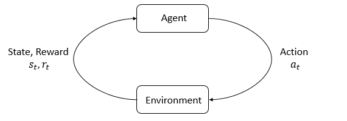

RL Theory Note
===

> Reference:
> 
> [OpenAI Spinning Up](https://spinningup.openai.com/en/latest/index.html)
> 
> Dknt 2024.12

Reinforcement learning (RL) is a machine learning approach for developing an **agent** interacting with an **environment** and taking **actions**. 

  

At each time step, the agent receives some **observation** from the environment and must choose an action that is subsequently transmitted back to the environment via **actuator**. After each loop, the agent receives a **reward** from the environment. The behavior of a reinforcement learning agent is governed by a **policy**, which is a function that maps from observations of the environment to actions. The goal of the agent is to maximize its cumulative reward: **return**. The goal of RL is to produce good policies.

---

A **state** $s$ is a complete description of the world. An **observation** $o$ is a partial description of a state. The environment can be **fully observed** or **partially observed**.

The set of all valid actions is **action space**. Environments may have **discrete action space** or **continuous action space**.

---

Policy can be **deterministic policy**:

$$
a_t = \mu (s_t)
$$

Or it can be **stochastic policy**:

$$
a_t \sim \pi (\cdot | s_t)
$$

In deep RL, we deal with **parameterized policies**, deep neural network:

$$
a_t = \mu_\theta (s_t)\\
a_t \sim \pi_\theta (\cdot | s_t)
$$

Two common kinds of stochastic policies are **categorical policies** and **diagonal policies**. The former can be used in discrete action spaces and the latter in continuous.

- Categorical Policy

A categorical policy is a neural network-based classifier for discrete actions. It takes the observation as input and outputs probabilities through a softmax layer. We use `torch.Categorical` to sample a categorical policy.

Denoting the output probabilities vector as $P_\theta (s)$, the log-likelihood for an action $a$ can be obtained by indexing into the log-likelihood vector.

$$
\log \pi_\theta (a | s) = \log [P_\theta (s)]_a
$$

- Diagonal Policy

A diagonal policy follows diagonal multivariate Gaussian distribution, whose covariance matrix is diagonal thus can be represented as a vector. A diagonal policy always have a neural network that maps from observations to mean actions $\mu_\theta (s)$. The covariance matrix is typically represented either as a single vector of log standard deviations $\log \sigma$, or $\log \sigma_\theta(s)$, which uses a neural network to map from state to log std.

> Log stds is used instead of stds directly, because log stds are free to take on any value in $(-\infin, \infin)$.

Given $\mu_\theta (s)$, $\sigma_\theta(s)$, and a vector $z$ of noise from a standard Gaussian distribution $\mathcal{N}(0,I)$, an sample action can be obtained by:

$$
a = \mu_\theta (s) + \sigma_\theta(s) \odot z
$$

where $\odot$ denotes the elementwise product. 

We can sample a Gaussian distribution by `torch.normal` or `torch.distributions.Normal`.

Log-likelihood:

$$
\log[\pi_\theta (a|s)] = -\frac{1}{2} \left(\sum_{i=1} \left(\frac{(a_i-\mu_i)^2}{\sigma_i^2} + 2\log{\sigma_i} \right) + k\log{2\pi} \right)
$$

> **Derivation**
> $$
\pi_\theta (a|s) = \frac{1}{(2\pi)^{k/2} \det (\Sigma(s))^{1/2}} \exp{\left\{ -\frac{1}{2} (a - \mu_\theta (s))^{\top} (\Sigma(s))^{-1} (a - \mu_\theta (s)) \right\}}
> $$
>
> $$
\begin{array}{rl}
  \log[\pi_\theta (a|s)] &= -\frac{1}{2}(k\log{2\pi} + \sum_{i=1}2\log{\sigma_i} + \sum_{i=1}\frac{(a_i-\mu_i)^2}{\sigma_i^2})\\
  &= -\frac{1}{2}(\sum_{i=1}(\frac{(a_i-\mu_i)^2}{\sigma_i^2} + 2\log{\sigma_i}) + k\log{2\pi})
\end{array}
> $$
> 

---

A **trajectory** (a.k.a. episode or rollout) $\tau$ is a sequence of states and actions in the world.

$$
\tau = (s_0, a_0, s_1, a_1, \ldots, s_T)
$$

The initial state of the world follows the start-state distribution:

$$
s_0 \sim \rho_0 (\cdot)
$$

State transitions are governed by the nature of the environment, they can be either deterministic or stochastic:

$$
s_{t+1} = f(s_t, a_t)\\
s_{t+1} = P(\cdot | s_t, a_t)
$$

The probability of a T-step trajectory is taken:

$$
P(\tau | \pi) = \rho_0(s_0) \prod_{t=0}^{T-1} P(s_{t+1}|s_t, a_t) \pi(a_t|s_t)
$$

> **Derivation**
>
> TODO

---

The **reward function** $R$ depends on the current state of the world, the action just taken, and the next state of the world.

$$
r_t = R(s_t, a_t, s_{t+1})
$$

One kind of return is the **finite-horizon undiscounted return**, which is the sum of rewards in a fixed window of steps:

$$
R(\tau) = \sum_{t=0}^{T} r_t
$$

Another kind of return is the **infinite-horizon discounted return**, which is the sum of all rewards ever obtained by the agent discounted by the **discount factor** $\gamma \in (0, 1)$:

$$
R(\tau) = \sum_{t=0}^{\infin} \gamma^t r_t
$$

The **excepted return** is:

$$
J(\pi) = \int_{\tau} P(\tau | \pi) R(\tau) = \underset{\tau \sim \pi}{\mathrm{E}}[R(\tau)]
$$

The central optimization problem is :

$$
\pi^{*} = \arg \max_\pi J(\pi)
$$

with $\pi^{*}$ being **optimal policy**.

---

By value of a state of state-action pair, we mean the expected return if we start in that state or state-action pair, and then act according to a particular policy forever after.

**On-Policy Value Function**

$$
V^\pi(s) = \underset{\tau \sim \pi}{\mathrm{E}}[R(\tau) | s_0 = s]
$$

**On-Policy Action-Value Function**

$$
Q^\pi(s, a) = \underset{\tau \sim \pi}{\mathrm{E}}[R(\tau) | s_0 = s, a_0 = a]
$$

**Optimal Value Function**

$$
V^*(s) = \max_\pi \underset{\tau \sim \pi}{\mathrm{E}}[R(\tau) | s_0 = s]
$$

**Optimal Action-Value Function**

$$
Q^*(s, a) = \max_\pi \underset{\tau \sim \pi}{\mathrm{E}}[R(\tau) | s_0 = s, a_0 = a]
$$

Relationships between the value function and the action-value function:

$$
V^\pi(s) = \underset{a \sim \pi}{\mathrm{E}}[Q^\pi(s, a) ]\\
V^*(s) = \max_a Q^*(s, a)
$$

**Advantage Function**

$$
A^\pi(s, a) = Q^\pi(s, a) - V^\pi(s)
$$

---

All four of the value functions obey the **Bellman equations**. The basic idea behind them is: the value of your starting point is the reward you expect to get from being there, puls the value of whatever you land next.

The Bellman equations for the on-policy value functions are:

$$
V^\pi(s) = \underset{a \sim \pi , s' \sim P}{\mathrm{E}}\left[ r(s,a) + \gamma V^\pi (s') \right]
$$

$$
Q^\pi(s, a) = \underset{s' \sim P}{\mathrm{E}}\left[ r(s,a) + \gamma \underset{a' \sim \pi}{E}[Q^\pi(s', a')] \right]
$$

The Bellman equations for the optimal value functions are:

$$
V^*(s) = \max_a \underset{s' \sim P}{\mathrm{E}}\left[ r(s,a) + \gamma V^* (s') \right]
$$

$$
Q^*(s, a) = \underset{s' \sim P}{\mathrm{E}}\left[ r(s,a) + \gamma \max_{a'}[Q^*(s', a')] \right]
$$

> Derive their probabilities.

A **Markov Decision Process (MDP)** is a 5-tuple: $<S, A, R, P, \rho_0>$.

---

RL algorithms can be divided in to two classes:

**On-Policy algorithms**. These methods don't use old data and directly optimize the objective we care about: estimated return. On-policy algorithms trades off sample efficiency in favor of stability. Representative algorithms:

* Vanilla Policy Gradient (VPG)
* Trust Region Policy Optimization (TRPO)
* Proximal Policy Optimization (PPO)

**Off-Policy algorithms**. They are able to reuse old data efficiently by exploiting Bellman's equation. There are no guarantees that satisfying Bellman's equations leads to having great policy performance, making this class potentially brittle and unstable.

* Deep Deterministic Policy Gradient (DDPG)
* Twin Delayed DDPG (TD3)
* Soft Actor-Critic (SAC)

---

Policy Gradient Method

<!-- CSS -->

