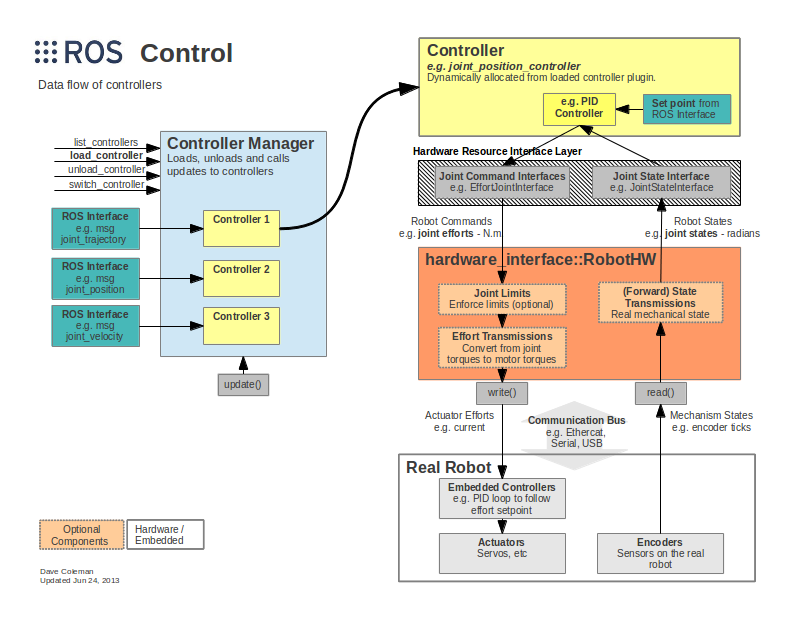

ROS Control Package
===

> Dknt 2025.1
> Reference:
> 1. [Slides](https://roscon.ros.org/2014/wp-content/uploads/2014/07/ros_control_an_overview.pdf)
> 2. [Documentation](https://docs.ros.org/en/melodic/api/hardware_interface/html/c++/index.html)
> 
> TODO: Study ROS2 controller.

ROS 1 `ros-control` packages. Structure overview:



They can: abstract hardware and simulation; make controllers generic to all robot; make controller subject to real-time constraints; provide an end-to-end solution for ROS users.

`ros-controls` contain the following packages: `control_msgs`, `realtime_tools`, `control_toolbox`, `ros_control` and `ros_controllers`.

# ROS Hardware Interface

`hardware_interface` is a software representation of robot, which abstracts hardware away and handles resource conflicts (exclusive ownership).

Under the `hardware_interface` is the low-level interface to read/write motors and sensors. It can be EtherCat based communication, API provided by the manufacturer or a software simulation. It is the user's responsibility to fill the low-level interface in `hardware_interface`.

Key components:

`hardware_interface::RobotHW` is a robot hardware abstraction, which can be used to send data to (`hardware_interface::RobotHW::write`) or receive data from (`hardware_interface::RobotHW::read`) the robot's resources, including joints, sensors and actuators.

`hardware_interface::HardwareResourceManager` is used to manage the hardware interfaces.

Available hardware interfaces include:

* `JointCommandInterface`, including `PositionJointInterface`, `VelocityJointInterface`, `EffortJointInterface`
* `JointStateInterfaces`
* `ActuatorStateInterfaces`, including `EffortActuatorInterface`, `VelocityActuatorInterface`, `PositionActuatorInterface`
* `ActuatorCommandInterfaces`
* `PosVelJointInterface`
* `PosVelAccJointInterface`
* `Force-torqueSensorInterface`
* `IMUSensorInterface`

An example implementation of `RobotHW`:

```cpp
#include <hardware_interface/joint_command_interface.h>
#include <hardware_interface/joint_state_interface.h>
#include <hardware_interface/robot_hw.h>
class MyRobot : public hardware_interface::RobotHW {
public:
  MyRobot() {
    // Initialization of the robot's resources (joints, sensors, actuators) and 
    // interfaces can be done here or inside init().
    // E.g. parse the URDF for joint names & interfaces, then initialize them
  }
  bool init(ros::NodeHandle &root_nh, ros::NodeHandle &robot_hw_nh) {
    // Create a JointStateHandle for each joint and register them with the 
    // JointStateInterface.
    hardware_interface::JointStateHandle state_handle_a("A", &pos[0], &vel[0], &eff[0]);
    jnt_state_interface.registerHandle(state_handle_a);
    hardware_interface::JointStateHandle state_handle_b("B", &pos[1], &vel[1], &eff[1]);
    jnt_state_interface.registerHandle(state_handle_b);
    // Register the JointStateInterface containing the read only joints
    // with this robot's hardware_interface::RobotHW.
    registerInterface(&jnt_state_interface);
    // Create a JointHandle (read and write) for each controllable joint
    // using the read-only joint handles within the JointStateInterface and 
    // register them with the JointPositionInterface.
    hardware_interface::JointHandle pos_handle_a(jnt_state_interface.getHandle("A"), &cmd[0]);
    jnt_pos_interface.registerHandle(pos_handle_a);
    hardware_interface::JointHandle pos_handle_b(jnt_state_interface.getHandle("B"), &cmd[1]);
    jnt_pos_interface.registerHandle(pos_handle_b);
    // Register the JointPositionInterface containing the read/write joints
    // with this robot's hardware_interface::RobotHW.
    registerInterface(&jnt_pos_interface);
    return true;
  }
  // Communication with hardware, using CanBus, EtherNet, EtherCat, serial port, etc. We can use ROS industrial, rosserial, SR RONEX...
  void read();  // Read from hardware
  void write();  // Write to hardware
  // Reimplement only if needed
  virtual bool CheckForConflict(const std::list<hardware_interface::ControllerInfo>& info) const override;
private:
  // hardware_interface::JointStateInterface gives read access to all joint values 
  // without conflicting with other controllers.
  hardware_interface::JointStateInterface jnt_state_interface;
  // hardware_interface::PositionJointInterface inherits from 
  // hardware_interface::JointCommandInterface and is used for reading and writing
  // joint positions. Because this interface reserves the joints for write access,
  // conflicts with other controllers writing to the same joints might occur.
  // To only read joint positions, avoid conflicts using 
  // hardware_interface::JointStateInterface.
  hardware_interface::PositionJointInterface jnt_pos_interface;
  // Data member array to store the controller commands which are sent to the 
  // robot's resources (joints, actuators)
  double cmd[2];
  // Data member arrays to store the state of the robot's resources (joints, sensors)
  double pos[2];
  double vel[2];
  double eff[2];
};
```

If we use Gazebo, we can add a `gazebo_ros_control` plugin into the urdf model, which is an implementation of `RobotHW` and provides interfaces to user.

# ROS Controllers

Controllers require resources, and they don't talk directly to HW. The resources are provided by `RobotHW`. Controllers are loaded via node `controller_manager` in package `controller_manager`, usually in a launch file.

Controller are dynamically loadable plugins. The interface defines a simple finite state machine. The computation of the controller can be RT or non-RT.

**Non RT operations**: Load, including load and initialize plugin, check requisites, setup ROS interfaces; Unload; Callbacks, which is executed asynchronously.

**RT safe operations**: Start executed before fist update; Stop executed after last update; Update, which is realtime safe computation and executed periodically.

Sample code of a customized ROS controller:

```cpp
#include <controller_interface/controller.h>
#include <hardware_interface/joint_command_interface.h>
#include <pluginlib/class_list_macros.hpp>
#include <ros/node_handle.h>
namespace my_custom_controller {
class MyController : public controller_interface::Controller<hardware_interface::EffortJointInterface> {
public:
  MyController() = default;
  ~MyController() override = default;
  // Called when the controller is initialized
  bool init(hardware_interface::EffortJointInterface* hw, ros::NodeHandle& nh) override {
    // Retrieve joint name from parameter server
    nh.getParam("joint_name", joint_name_);
    // Get the joint handle from the hardware interface
    joint_ = hw->getHandle(joint_name_);
    return true;
  }
  // Called when the controller starts
  void starting(const ros::Time& time) override {
    command_ = 0.0; // Reset the command
  }
  // Called periodically to update the controller. This function should be real time safe.
  void update(const ros::Time& time, const ros::Duration& period) override {
    // Do some computation...
    joint_.setCommand(command_);
  }
  // Called when the controller is stopped
  void stopping(const ros::Time& time) override {
    ROS_INFO("Controller stopping");
  }
private:
  std::string joint_name_;
  hardware_interface::JointHandle joint_;
  double command_;
};
} // namespace my_custom_controller
// Export the controller as a plugin
PLUGINLIB_EXPORT_CLASS(my_custom_controller::MyController, controller_interface::ControllerBase)
```

> **Tips to make a function real time safe**
> It must not block.
> It must not allocate memory.
> It must not call non-real-time-safe ROS functions, such as: publishing non-realtime topics, calling services, accessing parameter server.
> It must handle exceptions carefully.
> Use `RealtimeLoop` in `ros_control` framework.

# ROS Controller Manager

`controller_manager` manage robot resources, knowing available resources and enforcing resource conflicts. They can also manage controller lifecycle, including transitioning controller state machine, updating running controllers and making periodic or serialized updates.

Sample code:

```cpp
int main(int argc, char** argv) {
  ros::init(argc, argv, "my_robot");
  ros::NodeHandle nh;
  MyRobot robot;  // Robot hardware interface
  controller_manager::ControllerManager cm(&robot, nh);  // Controller manager
  // MyController controller;  // Controller TODO: how to add controller into controller manager
  // controller.load();  // Load controller
  // controller.start();  // Start controller
  ros::AsyncSpinner spinner(1);
  spinner.start();  // Start another non-RT thread to handle ROS callback
  ros::Rate rate(50);
  ros::Time prev_time = ros::Time::now();
  // Main control loop. This thread can be RT
  while (ros::ok()) {
    robot.read();  // Read from hardware
    cm.update(ros::Time::now(), ros::Time::now() - prev_time);  // Run controller
    robot.write();  // Write to hardware
    rate.sleep();
  }
  controller.stop();  // Stop controller
  controller.unload();  // Unload controller
  return 0;
}
```

# `control_toobox` Package

`control_toobox` provides useful tools  for writing controllers or robot abstractions: Pid, PID loop; SimeSweep, for joint frequency analysis; Dither, white noise generator; LimitedProxy, for convergence without overshoot.

# `ros_controllers` Package

Implemented controllers:

* `joint_state_controller`: Publishes joint states in `sensor_msgs/JointState` topic.
* `imu_sensor_controller`: Publishes IMU data in `sensor_msgs/Imu` topic.
* `force_torque_sensor_controller`: Publishes force/torque data in `geometry_msgs/Wrench` topic.
* `position_controllers`
* `velocity_controllers`
* `effort_controllers`
* `joint_trajectory_controller`: Take a `trajectory_msgs/JointTrajectory` message or `control_msgs/FollowJointTrajectory` action and execute it. This is compatible with MoveIt!
* `diff_drive_controller`: Take `geometry_msgs/Twist` message and convert it to wheel velocities. It is compatible with ROS navigation stack.
* `gripper_action_controller`: Take `control_msgs/GripperCommand`. It is compatible with MoveIt!

# `realtime_tools` Package

`RealtimePublisher`, `RealtimeBuffer`, `RealtimeClock`

# `transmission_interface` Package

Propagate between actuator and joint space. Handle position, velocity and effort variables.

Available transmissions: simpler reducer, four-bar linkage, differential drive, etc. There are plugins for loading from URDF.

<!-- CSS -->
<head>
  <style>
    .center-img {
      display: block;
      margin-left: auto;
      margin-right: auto;
      width: 800px;
    }
  </style>
</head>
