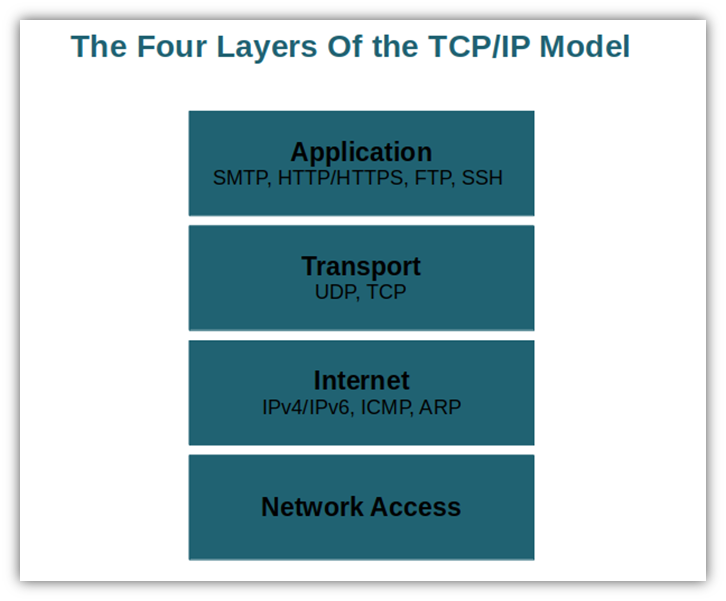
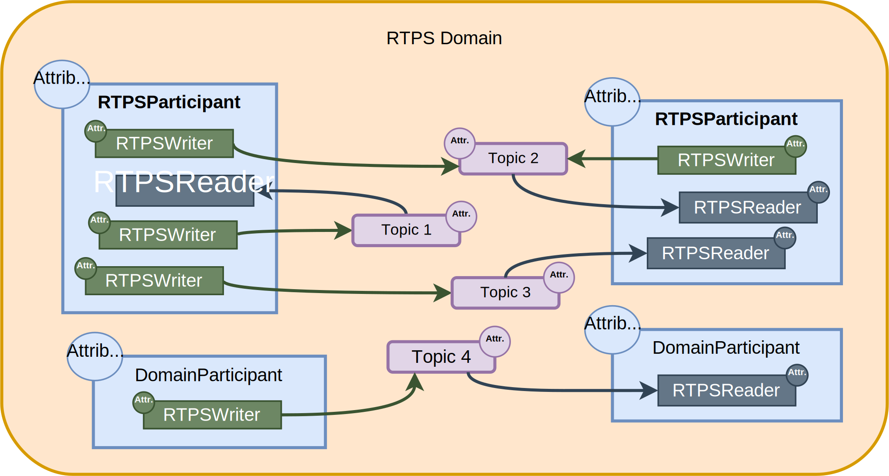

Fast DDS Note
===

> To know ROS 2 better. To use a reliable and customizable communication protocol in my own project.
> 
> Dknt 2024.10
> 
> Reference:
> [eProsima Fast DDS Documentation](https://fast-dds.docs.eprosima.com/en/v3.1.0/)

# 0 Installation

You can install DDS binary package installed from official website. The binary package supports only C++.

To use FastDDS in both C++ and Python, you should manually build the hold FastDDS from source code, including Foonathan, Fast CDR, Fast DDS, FastDDS Python, and Fast DDS Gen. Refer to [documentation](https://fast-dds.docs.eprosima.com/en/latest/installation/sources/sources_linux.html#colcon-installation). You should use `fastddsgen` and the library from the same build to prevent version mismatch error or some link error.

On Nvidia Jetson, `findpackage(fastdds REQUIRED)` will fail. I'v solved this by using `set(fastdds "<path-to-fastdds>/fastdds.so")`.

# 1 Basis

## 1.1 Network Basis

TCP/IP 4-layer model:

<div class="center-image">
  
</div>

Terms:

- Switch (交换机)
- Bridge (网桥)
- Router (路由器)
- Hub (分线器)
- Bridge mode.
- Router mode.

## 1.2 DDS Basis

Terms:

1. DDS - Data Distribution Service
2. RTPS - Real-Time Publish-Subscribe
3. QoS - Quality of Service
4. DCPS - Data-Centric Publish Subscribe
5. IDL - Interface Description Language
6. SHM - Shared Memory Transport

The communication model adopted by DDS is a **many-to-many unidirectional** data exchange where the applications that produce the data publish it to the **local caches** of subscribers belonging to applications that consume the data. The information flow is regulated by **QoS policies** established between the entities in charge of the data exchange.

The communication happens across **domains**. Only entities belonging to the same domain can discover each other. The matching between publishers and subscribers is mediated by **topics**. Topics are unambiguous identifiers that associate a name, which is unique in the domain, to a data type and a set of attached data-specific QoS.

DDS entities are modeled either as **classes** or **typed interfaces**. The latter imply a more efficient resource handling as knowledge of the data type prior to the execution allows allocating memory in advance rather than dynamically.

The protocol used by eProsima Fast DDS to exchange messages over standard networks is the **RTPS protocol**, which provides publisher-subscriber communications over transports such as TCP/UDP/IP, and guarantees compatibility among different DDS implementations. All the RTPS core entities are associated with an RTPS domain, which represents an isolated communication plane where endpoints match. The entities specified in the RTPS protocol are in one-to-one correspondence with the DDS entities, thus allowing the communication to occur.

### 1.2.1 DCPS Conceptual Model

DDS is a DCPS model. DCPS model contains 4 basic elements:

1. Publisher - It is the DCPS entity in charge of the creation and configuration of the **DataWriters** it implements. The DataWriter actually publics messages.
2. Subscriber - It is the DCPS Entity in charge of receiving the data published under the topics to which it subscribes. It serves one or more DataReader objects.
3. Topic - It is the entity that binds publications and subscriptions.
4. Domain - The individual applications that participate in a domain are called DomainParticipant.

<div class="center-image">
  
</div>

### 1.2.2 RTPS Protocol

The Real-Time Publish Subscribe (RTPS) protocol, developed to support DDS applications, is a publication-subscription communication middleware over best-effort transports such as UDP/IP. Furthermore, Fast DDS provides support for TCP and Shared Memory (SHM) transports.

Endpoints of RTPS:

1. RTPSWriter - Endpoint able to send data.
2. RTPSReader - Endpoint able to receive data.

<div class="center-image">
  
</div>

The topics do not belong to a specific participant. The participant, through the RTPSWriters, makes changes in the data published under a topic, and through the RTPSReaders receives the data associated with the topics to which it subscribes. The communication unit is called Change, which represents an update in the data that is written under a Topic. RTPSReaders/RTPSWriters register these changes on their History, a data structure that serves as a cache for recent changes.

In the default configuration of eProsima Fast DDS, when a change is published a through a RTPSWriter endpoint, the following steps happen behind the scenes:

1. The change is added to the RTPSWriter’s history cache.
2. The RTPSWriter sends the change to any RTPSReaders it knows about.
3. After receiving data, RTPSReaders update their history cache with the new change.

### 1.2.3 Architecture

The architecture of Fast DDS can be abstracted as a layer model, which consists of 4 layers:

1. Application layer. Applications using the Fast DDS API for communications in distributed systems.
2. Fast DDS layer. DDS communications middleware.
3. RTPS layer. This layer acts an abstraction layer of the transport layer.
4. Transport layer. UDP, TCP, SHM.

<div class="center-image">
  
</div>


# 2 Programming

## 2.1 Fast DDS C++

Fast DDS-Gen is a Java application that generates source code using the data types defined in an IDL file.

Usage:

```shell
fastddsgen TopicName.idl
```

This generates the following files for the data type defined in the .idl file:

```shell
HelloWorld.hpp  # HelloWorld type definition.
HelloWorldPubSubTypes.cxx  # Interface used by Fast DDS to support HelloWorld type.
HelloWorldPubSubTypes.h  # Header file for HelloWorldPubSubTypes.cxx.
HelloWorldCdrAux.ipp  # Serialization and Deserialization code for the HelloWorld type.
HelloWorldCdrAux.hpp  # Header file for HelloWorldCdrAux.ipp.
HelloWorldTypeObjectSupport.cxx  # TypeObject representation registration code.
HelloWorldTypeObjectSupport.hpp  # Header file for HelloWorldTypeObjectSupport.cxx.
```

See the example code and comments in `HelloWorldPublisher.cc` and `HelloWorldSubscriber.cc` under `src/01_helloworld_ws`.

The Fast DDS API is thread safe, so one can fearlessly call any methods on the same DomainParticipant from different threads. However, this multithreading implementation must be taken into account when external functions access to resources that are modified by threads running internally in the library. For instance, members of the listener callback class.


## 2.2 Fast DDS Python

> Fast DDS python is currently not supported to install through apt, neither binary installation. It can only be installed by building the source code. As Cpp will be used in most of my project, Fast DDS python is omitted here.

To use Fast DDS in python, run:

```shell
fastddsgen -python TopicName.idl
```

Then run the following command to generate python bindings:

```shell
cmake .
make
```

> There may be link error when building with static fastdds library. This can be solved using a shared fastdds library: add `set(BUILD_SHARED_LIBS ON)` before `find_package(fastdds)`

# 3 CLI Tool

1

# 4 FastDDS Monitor

1

<!-- CSS Class Definition -->
<style>
  .center-image {
    display: flex;
    justify-content: center;
    align-items: center;
  }

  .center-image img {
    max-width: 100%;
    max-height: 100%;
    background-color: #FFFFFFAA;
    padding: 10px;
  }
</style>
