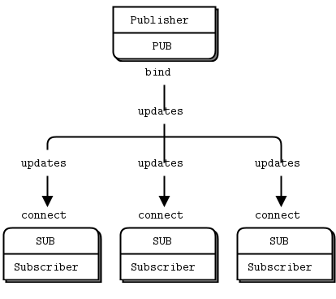

# ZeroMQ C++ 入门

ZeroMQ (Zero Message Queue，零消息队列)  是一个高效的异步消息通信框架，吞吐量大、延迟低。

ZMQ位于传输层，是Socket的一系列接口。BSD Socket是端到端（1:1）的，而ZMQ可以实现N:M的关系。点对点连接需要显式地建立连接、销毁连接、选择协议（TCP/UDP）和处理错误等，而ZMQ屏蔽了这些细节，让你的网络编程更为简单。

它提供了一个消息队列，但与面向消息的中间件不同，ZeroMQ系统可以在没有专用消息代理的情况下运行。

支持多种通用消息传递模式，如发布/订阅（publish/subscribe，topic）、请求/回复（request/reply）、客户端/服务端（client/server）。这些消息传递模式可以基于多种传输协议，如TCP、进程内、进程间、多传播、WebSocket等。

ZMQ是一个C项目，提供C++、Python、JAVA等语言的接口。

> 部分官方例程不能很好地展现特性，稍加以修改。

## 1 ZeroMQ安装

ZeroMQ有好几个C++库，我们需要的是与cppzmq。cppzmq是在libzmq上的C++ API。

> zmqpp是在cppzmq基础上封装的接口，在应用上zmqpp更加方便。但是，zmqpp没有文档，几乎没有资料，源码里注释写的一塌糊涂，我看不懂，就不用它了。

> zmpqq提供message类，方便进行数据传送。但这和我们有什么关系呢。

> libsodium一个密码学软件库，如果要使用zmq4安全功能，则需要先安装这个库。我们不用。

安装libzmq与cppzmq接口

```shell
$ git clone https://github.com/zeromq/libzmq.git
$ cd libzmq
$ ./autogen.sh
$ ./configure --prefix=/usr
$ make -j16
$ sudo make install
$ sudo ldconfig
```

~~安装zmqpp~~（不用装，不好用）

```shell
$ git clone https://github.com/zeromq/zmqpp.git
$ cd zmqpp
$ mkdir build
$ cd build
$ cmake ..
$ make -j16
$ sudo make install
```

## 2 ZeroMQ编程

### 2.1 socket对象

ZMQ基于BSD socket，进行任何模式的通信前都需要先创建相应类型的socket对象。

```cpp
zmq::context_t context; // 获取上下文
zmq::socket_t socket(context, zmq::socket_type::ANY_TYPE); // 建立socket
```

创建socket对象后，可以将其连接到端口，进行通信。`send`和`recv`函数是阻塞式的。

使用绑定`bind`或是连接`connect`要时情况而定。通常在模型中，一个端口上唯一的一类socket使用`bind`连接，可能存在多个的socket类型使用`connect`连接。

```cpp
socket.bind("tcp://*:5555"); // 服务端
socket.connect("tcp://*:5555"); // 客户端
socket.send(reply, zmq::send_flags::FLAG);
socket.recv(request, zmq::recv_flags::FLAG);
```

### 2.2 message消息

消息是ZMQ的数据传输单元。

> 消息可以包含多个部分，ZMQ保证能完整传递整个消息。

发送端的消息在创建时一定要给出大小！

```cpp
zmq::message_t  message(SIZE);
memcpy(message.data(), (void*)data, sizeof(data)); // 向消息添加成分
```

发送与接收消息。

```cpp
socket.send(reply, zmq::send_flags::FLAG); // 发送
socket.recv(request, zmq::recv_flags::FLAG); // 接收
```

从ZeroMQ本身的角度来看，消息被认为是**透明的二进制数据**，ZMQ只直到需要传输数据的**字节数**。因此我们需要保证在发送端数据可以被放入消息，在接收端能顺利从消息中将数据提取出来，数据是如何。对于复杂的对象和数据结构，需要使用类似**Protocol Buffers**的库。

C风格字符串以`'\0'`结尾，即`"Hello"`这样的字符串实际长度为6字节。但在Python或其他语言中，这个字符串长度为5字节。在socket间发送字符串时，需要考虑`'\0'`引来的问题，因为我们不能确定对方socket是用什么语言编写的。在C语言下接收字符串时，要创建一块比这个字符串多一字节的字符串用于接收，并将其最后一个字符写`'\0'`。通常规定ZMQ中的字符串是不带结束符的。

message为字符串提供了特殊函数`to_string`。

```cpp
memcpy(reply.data(), "World", 5); // 添加字符串成分
cout << reply.to_string() << endl; // 字符串消息解析
```

### 2.3 请求/回应模式(Req/Rep)

如下图所示，客户端向服务器端发送请求，服务器端单独回复服务器的这个请求。是一种双向1对N模型。可以有多个client，但服务器与客户端必须是1问1答的形式。

在请求回应模式中，客户端与服务器端socket的recv和send函数是**互锁**的，服务器端在处理完一个客户端的请求前，不能处理其他客户端的请求（这些请求会暂村在缓存区中），否则返回-1。同样的，客户端在接收到回复前，不能再发送请求。

recv和send是**阻塞式**函数，因此先运行客户端和服务器端中的任何一个都可以，他们会互相等。


**服务器端socket**

```cpp
zmq::socket_t socket(context, zmq::socket_type::rep);
socket.bind(endpoint);
while(true){
    socket.recv(request, zmq::recv_flags::none);
    ...
    socket.send(reply, zmq::send_flags::none);
}
```

**客户端socket**

```cpp
zmq::socket_t socket(context, zmq::socket_type::req);
socket.connect(endpoint);
while(true){
    socket.send(request, zmq::send_flags::none);
    ...
    socket.recv(reply, zmq::recv_flag::none);
}
```

### 2.4 发布/订阅模式(Pub/Sub)

发布者发送消息，订阅者接受消息。无论是否存在订阅者、订阅者接收到的消息是否正确，发布者都将继续发布消息，即发布者不清楚任何有关订阅者的信息。是一种单向1对N模型。


在发布/订阅模型中，**发布者socket只能发送消息**，**订阅者socket只能接收消息**。如果发布者调用`recv`，会产生错误，订阅者同理。

订阅者必须通过函数`setsockopt`**订阅频道**，才能接收到发布者的消息，如果不订阅是无法收到消息的。订阅频道的原理是**字符串匹配**，如果消息的开头与订阅的“频道”匹配，则接收这条消息。订阅者可以订阅**多个频道**，订阅者也可以连接到**多个发布者**。

注意，ZMQ不保证订阅者接收到发布者的每一条消息。比如，发布者的第一条消息通常是不会被接收到的，因为两个socket在建立TCP连接过程时需要**三次握手**（大概几毫秒时间），在握手完成连接成功时，消息可能已经被发送出去了。

如何实现消息的同步？请阅读[章节2](https://zguide.zeromq.org/docs/chapter2/)（我大概是懒得看）。

**发布者socket**

```cpp
zmq::socket_t publisher(context, zmq::socket_type::pub);
publisher.bind(endpoint);
while(true){
    ...
    publisher.send(message, zmq::send_flags::none);
}
```

**订阅者socket**

```cpp
zmq::socket_t subscriber(context, zmq::socket_type::sub);
subscriber.connect(endpoint);
subscriber.setsockopt(ZMQ_SUBSCRIBE, FILTER, strlen(FILTER));
while(true){
    subscriber.recv(message, zmq::recv_flag::none);
    ...
}
```

注意：

* 使用TCP时，如果发布者速度快，订阅者速度慢，那么消息会被存放在发布者消息的队列中。

* 消息的按频道过滤可能发生在订阅者，也可能发生在发布者，视协议而定。对于TCP，过滤是发生在发布方的。

### 2.5 分割/归并模式()

模型如下图。假设发生器（ventilator）生成的任务时可以被并行处理的，任务与任务，存在多个工作者（worker）处理分配到的任务，任务的处理结果被一个接受器（sink）接收并处理。


对于问题中的发生器、工作者、接收器，ZMQ并没有提供专门的socket类型，但可以使用推送/拉取(Push/Pull)模式来实现这个过程。

推送端与拉取端是一种1对N的关系。可以存在1个推送端、多个拉取端，也可以存在一个拉取端、多个推送端，但不能同时存在多个推送端与多个拉取端。

同批次中的工作者必须同时开始运行。发生器push socket分配时**负载均衡**，会将任务均匀地分配给工作者。注意这里的负载均衡不考虑工作者的工作能力，只是平均分配。在运行时也可以看出来，发生器很快就可以分配完任务并退出，但工作者这时候才刚刚开始处理延时，这说明push socket会把消息发送到缓存队列中。

**推送端socket**

```cpp
zmq::socket_t sender(context, zmq::socket_type::push);
publisher.bind(endpoint); // 这里的bind和connect要视情况而定
while(true){
    ...
    sender.send(message, zmq::send_flags::none);
    ...
}
```

**拉取端socket**

```cpp
zmq::socket_t receiver(context, zmq::socket_type::pull);
receiver.connect(endpoint);
while(true){
    ...
    receiver.recv(message, zmq::recv_flag::none);
    ...
}
```
